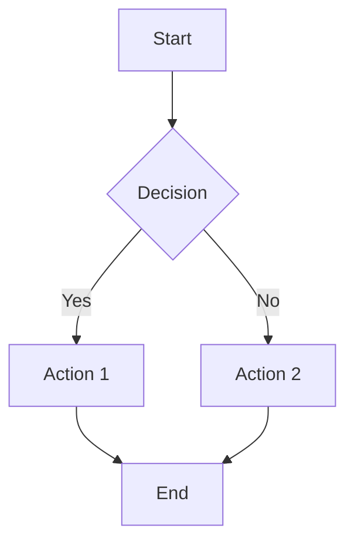
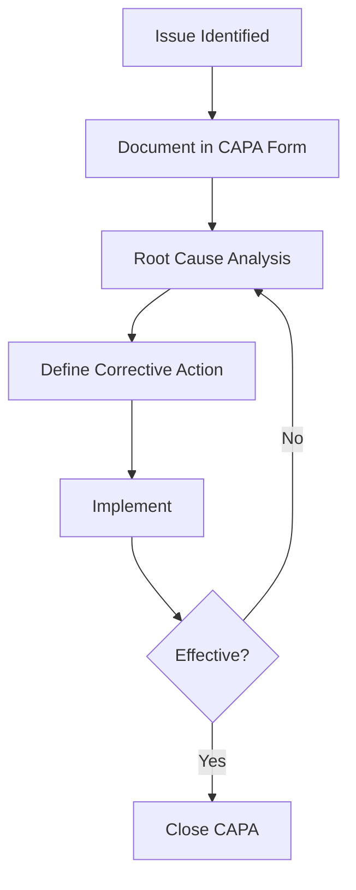
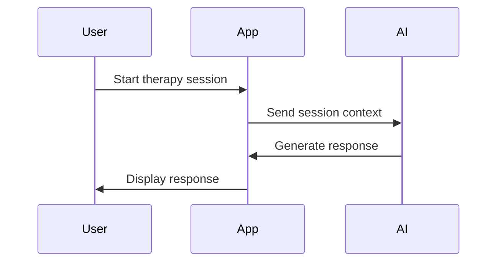
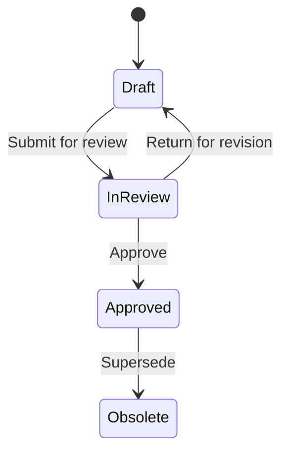
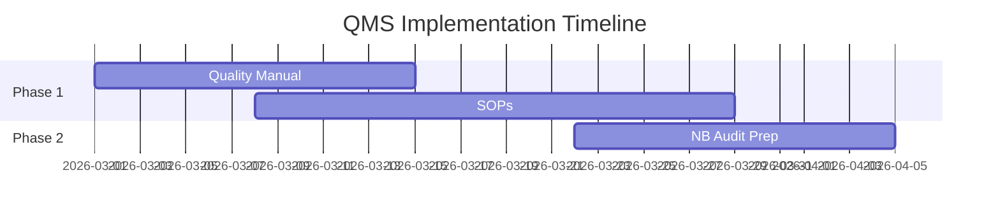
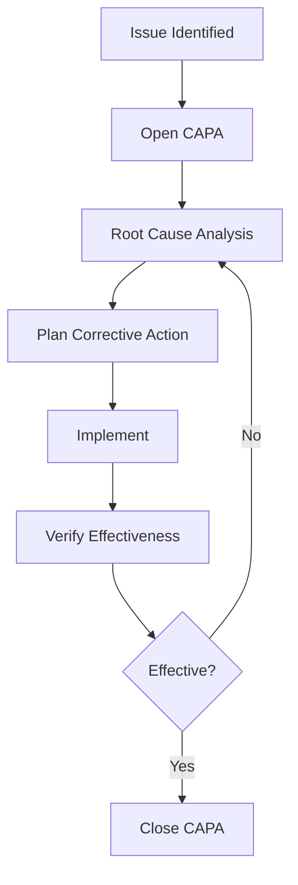
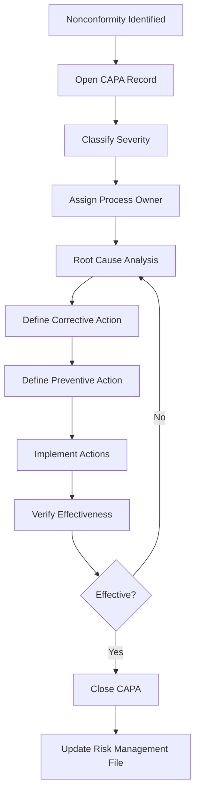

# QMS Project Context

## Company
- Building a Quality Management System (QMS) for EU medical device certification
- Target market: EU only

## Device
- Type: AI-based therapy software (Software as a Medical Device / SaMD)
- Classification: Class IIa (EU MDR)
- Conformity assessment route: Annex IX (likely)
- Key considerations: AI model validation, retraining/updates as design changes, clinical evidence for therapy effectiveness, cybersecurity, GDPR (health data)

## Regulatory Framework
- **ISO 13485:2016** — QMS standard for medical devices
- **EU MDR 2017/745** — European Medical Device Regulation
- **ISO 14971** — Risk management
- Both ISO 13485 and EU MDR must be satisfied simultaneously
- IEC 62304 (software lifecycle) and IEC 62366-1 (usability) may be needed later for technical documentation phase, but not required for initial QMS setup per legal advice

## Timeline
- NB (Notified Body) audit engagement starts: April 7, 2026
- QMS must be established and documented before NB engagement
- The NB will audit the QMS against both ISO 13485 and EU MDR

## Reference Documents in this Directory
- `references/` — All regulatory reference documents as markdown (viewable on the platform at `/references`)
  - `references/iso-13485.md` — Full ISO 13485:2016 standard text
  - `references/iso-14971.md` — Full ISO 14971:2019 standard text
  - `references/eu-mdr.md` — Full EU MDR 2017/745 regulation text (all 123 articles, Annexes I–XVI)
  - `references/mdcg-2019-9.md` — MDCG 2019-9 Rev.1: Summary of Safety and Clinical Performance
  - `references/mdcg-2019-11.md` — MDCG 2019-11 Rev.1: Guidance on Qualification and Classification of Software
  - `references/mdcg-2019-16.md` — MDCG 2019-16 Rev.1: Guidance on Cybersecurity for Medical Devices
  - `references/mdcg-2020-1.md` — MDCG 2020-1: Clinical Evaluation of Medical Device Software
  - `references/mdcg-2020-7.md` — MDCG 2020-7: PMCF Plan Template
  - `references/mdcg-2021-24.md` — MDCG 2021-24: Classification of Medical Devices
  - `references/mdcg-2025-4.md` — MDCG 2025-4: MDSW Apps on Online Platforms
  - `references/mdcg-2025-6.md` — MDCG 2025-6: MDR/IVDR and AI Act Interplay
  - `references/mdcg-2025-10.md` — MDCG 2025-10: Post-market Surveillance Guidance
- `examples/` — **REAL example files for each content type** (not visible in the QMS, for AI reference only):
  - `example-sop.md` — Full SOP with all sections (CAPA Procedure)
  - `example-form.form.json` — Full form with all field types (CAPA Form)
  - `example-diagram.md` — Diagram document with Mermaid flowchart
  - `example-quality-manual.md` — Quality Manual with org chart and process interactions
  - `example-plan.md` — Risk Management Plan with risk matrix
  - `example-policy.md` — Quality Policy
  - `example-uploaded-file.meta.json` — Sidecar metadata for uploaded files
  - **ALWAYS read the relevant example file before creating a new document of that type**

## References Platform Feature
- All reference documents are viewable at `/references` on the platform
- Each document has a sidebar with file list and table of contents with scroll-spy highlighting
- Document metadata fields `iso_refs` and `mdr_refs` in QMS documents generate clickable links to the reference pages with anchor navigation (e.g. `iso_refs: ["4.2.2"]` links to `/references/iso-13485#clause-4-2-2`)
- References are NOT part of the controlled QMS document system — they have no doc IDs, no publish workflow, no version tracking
- The reference files support markdown footnotes (via CommonMark Footnote extension) and auto-linked URLs (via Autolink extension)
- When writing QMS documents, read the relevant reference file to ensure accurate clause/article citations
- You can link directly to specific sections in reference documents from QMS document markdown content using standard markdown links:
  - ISO 13485 clause: `[Clause 4.2.4](/references/iso-13485#clause-4-2-4)`
  - ISO 14971 clause: `[Clause 7.1](/references/iso-14971#71-risk-control-option-analysis)`
  - EU MDR article: `[Article 10](/references/eu-mdr#article-10-general-obligations-of-manufacturers)`
  - EU MDR annex: `[Annex I](/references/eu-mdr#annex-i-general-safety-and-performance-requirements)`
  - MDCG document: `[MDCG 2019-11](/references/mdcg-2019-11)`
  - MDCG section: `[MDCG 2019-11, Section 3.2](/references/mdcg-2019-11#32-medical-device-software-mdsw)`
- The anchor IDs are auto-generated slugs from the heading text (lowercase, hyphens, no special chars)
- The `iso_refs` and `mdr_refs` frontmatter fields also auto-generate clickable links to references in the document metadata header

## Key MDR Sections for QMS
- **Article 10** — General obligations of manufacturers
- **Annex I** — General Safety and Performance Requirements (GSPR)
- **Annex II** — Technical documentation structure
- **Annex VIII** — Classification rules (Class IIa justification)
- **Annex IX** — Conformity assessment (quality management system + technical documentation assessment)
- **Annex XIV** — Clinical evaluation and post-market clinical follow-up

## Key ISO 13485 Clauses for QMS
- **Clause 4** — Quality management system (documentation, quality manual, device files)
- **Clause 5** — Management responsibility
- **Clause 6** — Resource management
- **Clause 7** — Product realization (design controls, purchasing, production, traceability)
- **Clause 8** — Measurement, analysis and improvement (CAPA, complaints, audits)

## Approach
- QMS documents are being built using Claude Code
- All reference standards/regulations are stored in `qms/references/` as markdown — readable by both AI and humans via the platform
- Documents should cross-reference both ISO 13485 clauses and MDR requirements using `iso_refs` and `mdr_refs` frontmatter fields
- QMS documents are stored in `qms/documents/` and viewable at `/qms`
- Reference documents are stored in `qms/references/` and viewable at `/references`
- The platform has: Documents (viewer + editor with sidebar), Browser, History, References, Dashboard, User management

---

## Document System Guide

### Overview

The QMS platform supports four content types:

1. **Markdown documents** (`.md`) — The default for all text-based QMS documents (SOPs, policies, plans, manuals, etc.)
2. **Forms** (`.form.json`) — Interactive fillable forms (CAPA forms, deviation reports, audit checklists, etc.)
3. **Uploaded files** — Binary files of any type (PDFs, images, spreadsheets, certificates, etc.)
4. **Diagrams** — Created using Mermaid.js syntax inside markdown documents

All content lives in `qms/documents/` and subdirectories within it.

---

### 1. Markdown Documents (`.md`)

#### File Location and Naming
- All files go in `qms/documents/` or subdirectories (e.g., `qms/documents/procedures/`)
- Use kebab-case, all lowercase: `document-control.md`, `risk-management.md`
- The display name comes from the frontmatter `title` field, not the filename

#### Frontmatter Format
Every markdown document MUST have YAML frontmatter at the top. Use double quotes on all values. Fixed field order for clean git diffs.

```markdown
---
id: "SOP-001"
title: "Document Control Procedure"
type: "SOP"
version: "0.1"
status: "draft"
author: "Sarp Derinsu"
effective_date: "2026-04-01"
iso_refs:
  - "4.2.4"
  - "4.2.5"
mdr_refs:
  - "Annex I, Section 3"
---

# Document Control Procedure

Content goes here...
```

#### Frontmatter Fields

| Field | Required | Format | Description |
|-------|----------|--------|-------------|
| `id` | Yes | `"TYPE-NNN"` | Unique document ID. Auto-generated via `DocumentMetadata::nextId()`. Never reuses numbers. |
| `title` | Yes | `"string"` | Human-readable title shown in sidebar and header. |
| `type` | Yes | `"TYPE"` | Document type prefix (see types table below). |
| `version` | Yes | `"0.1"` | Version string. Always quoted. |
| `status` | Yes | `"draft"` | One of: `draft`, `in_review`, `approved`, `obsolete` |
| `author` | Yes | `"Name"` | Author/owner name. |
| `effective_date` | No | `"YYYY-MM-DD"` | Date the document becomes effective. |
| `iso_refs` | No | List of strings | ISO 13485 clause references. |
| `mdr_refs` | No | List of strings | EU MDR references. |

#### Frontmatter Rules
- All values MUST be double-quoted (e.g., `version: "0.1"` not `version: 0.1`)
- Field order must be: id, title, type, version, status, effective_date, author, iso_refs, mdr_refs
- The `build()` method in `DocumentMetadata` handles this automatically
- The `parse()` method strips frontmatter from body — the editor only shows the body content
- A safety method `stripFrontmatter()` prevents accidental duplication
- Use `preg_replace('/\.md$/', '', $path)` to strip `.md` from paths (NOT `str_replace`)

#### Creating Markdown Documents with Claude Code
```php
// Get next available ID
$docId = DocumentMetadata::nextId('SOP', base_path('qms/documents'));

// Build frontmatter + body
$meta = [
    'id' => $docId,
    'title' => 'CAPA Procedure',
    'type' => 'SOP',
    'version' => '0.1',
    'status' => 'draft',
    'author' => 'Sarp Derinsu',
    'iso_refs' => ['8.5.2', '8.5.3'],
    'mdr_refs' => ['Article 10(9)'],
];
$body = "# CAPA Procedure\n\n## 1. Purpose\n...";
$content = DocumentMetadata::build($meta, $body);

// Write file
File::put(base_path('qms/documents/procedures/capa.md'), $content);
```

Or write the file directly as text:
```markdown
---
id: "SOP-003"
title: "CAPA Procedure"
type: "SOP"
version: "0.1"
status: "draft"
author: "Sarp Derinsu"
iso_refs:
  - "8.5.2"
  - "8.5.3"
mdr_refs:
  - "Article 10(9)"
---

# CAPA Procedure

## 1. Purpose
...
```

#### Standard Document Structure
Follow this structure for SOPs and procedures:
1. **Purpose** — Why this document exists
2. **Scope** — What it covers
3. **Responsibilities** — Who does what (use tables)
4. **Procedure** — Step-by-step process (use numbered subsections)
5. **Records** — What records are generated
6. **References** — Links to related documents using `[[DOC-ID]]` syntax

#### Document Linking
Write `[[SOP-001]]` anywhere in markdown body → renders as a clickable link to that document. Resolves by document ID regardless of file location. If ID doesn't exist, shows as red "(not found)".

#### Markdown Features Supported
- Headings (`#`, `##`, `###`)
- Bold, italic, strikethrough
- Bullet lists, numbered lists
- Tables (with proper header rows)
- Links, images
- Code blocks (including Mermaid diagrams)
- Blockquotes
- Horizontal rules

---

### 2. Forms (`.form.json`)

Forms are interactive fillable documents. They are stored as JSON files with metadata and field definitions in a single file (NO sidecar `.meta.json` needed).

#### File Format
```json
{
    "id": "FM-001",
    "title": "CAPA Form",
    "type": "FM",
    "version": "0.1",
    "status": "draft",
    "author": "Sarp Derinsu",
    "fields": [
        {
            "label": "CAPA Number",
            "type": "text",
            "required": true
        },
        {
            "label": "Date Identified",
            "type": "date",
            "required": true
        },
        {
            "label": "Severity",
            "type": "select",
            "required": true,
            "options": ["Low", "Medium", "High", "Critical"]
        },
        {
            "label": "Description of Issue",
            "type": "textarea",
            "required": true
        },
        {
            "label": "Root Cause Analysis Completed",
            "type": "checkbox"
        }
    ]
}
```

#### Supported Field Types
| Type | Renders As | Notes |
|------|-----------|-------|
| `text` | Single-line text input | |
| `textarea` | Multi-line text area | |
| `date` | Date picker | |
| `number` | Number input | |
| `email` | Email input | |
| `select` | Dropdown | Requires `options` array |
| `checkbox` | Checkbox | Returns "Yes" / "No" |

#### Field Properties
| Property | Required | Description |
|----------|----------|-------------|
| `label` | Yes | Field label shown to the user |
| `type` | Yes | One of the types above |
| `required` | No | Boolean, defaults to false |
| `options` | For select | Array of option strings |
| `description` | No | Help text shown below the field |

#### Form File Naming
- Use kebab-case: `capa-form.form.json`
- The `.form.json` extension is required — the system identifies forms by this extension

#### Creating Forms with Claude Code
Write the JSON file directly:
```bash
# Get next FM ID first by checking existing forms
# Then write the file:
```
```json
{
    "id": "FM-001",
    "title": "CAPA Form",
    "type": "FM",
    "version": "0.1",
    "status": "draft",
    "author": "Sarp Derinsu",
    "fields": [...]
}
```
Save to: `qms/documents/forms/capa-form.form.json`

#### Form Submissions
- Users fill forms via the UI → submissions stored in `form_submissions` database table
- Each submission records: form_id, user, title/reference, all field data as JSON, status, timestamp
- Submissions are shown on the form's view page

---

### 3. Uploaded Files (Binary)

Any file type can be uploaded: PDF, images, Word docs, Excel, etc.

#### How They Work
- The actual file is stored in `qms/documents/` (e.g., `qms/documents/certificates/iso-certificate.pdf`)
- A sidecar metadata file is created alongside: `iso-certificate.pdf.meta.json`
- The `.meta.json` file contains the same metadata fields as markdown frontmatter

#### Sidecar Metadata Format
```json
{
    "id": "CER-001",
    "title": "ISO 13485 Certificate",
    "type": "CER",
    "version": "1.0",
    "status": "approved",
    "author": "Sarp Derinsu"
}
```

#### System Files (Hidden)
These files are hidden from the UI:
- `.gitkeep` — keeps empty directories in git
- `*.meta.json` — sidecar metadata for uploaded files

#### Uploading Files with Claude Code
For binary files, you'd typically upload through the UI. But if needed, copy the file to the directory and create the sidecar:
```php
DocumentMetadata::writeSidecar($fullPath, [
    'id' => $docId,
    'title' => 'ISO 13485 Certificate',
    'type' => 'CER',
    'version' => '1.0',
    'status' => 'approved',
    'author' => 'Sarp Derinsu',
]);
```

#### File Viewing
- **Images** — inline preview in the document viewer
- **PDFs** — embedded iframe viewer
- **Other files** — file info card with download button
- All files show metadata bar (ID, type, status, version) same as markdown documents

---

### 4. Diagrams (Mermaid.js)

Diagrams are created inside markdown documents using Mermaid.js fenced code blocks. They render as visual diagrams in the viewer and editor preview.

#### Syntax
````markdown

````

#### Diagram Types for QMS

**Flowcharts** — Process flows, decision trees:
````markdown

````

**Sequence Diagrams** — System interactions:
````markdown

````

**State Diagrams** — Status workflows:
````markdown

````

**Gantt Charts** — Timelines:
````markdown

````

#### Diagram Document Example
A diagram document (type `DWG`) is just a markdown file:
```markdown
---
id: "DWG-001"
title: "CAPA Process Flow"
type: "DWG"
version: "0.1"
status: "draft"
author: "Sarp Derinsu"
iso_refs:
  - "8.5.2"
---

# CAPA Process Flow

This diagram shows the corrective and preventive action process.



## References
- [[SOP-003]] CAPA Procedure
- [[FM-001]] CAPA Form
```

You can have multiple diagrams in one document, with text around them.

---

### Document Types and ID Prefixes

| Prefix | Type | Use For |
|--------|------|---------|
| `QM` | Quality Manual | The top-level QMS document |
| `POL` | Policy | Quality policy, data privacy policy, etc. |
| `SOP` | Standard Operating Procedure | Step-by-step procedures (CAPA, complaints, audits, etc.) |
| `WI` | Work Instruction | Detailed instructions for specific tasks |
| `FM` | Form | Fillable forms — use `.form.json` format (CAPA forms, deviation forms, etc.) |
| `TMP` | Template | Document templates (report templates, meeting minutes templates, etc.) |
| `PLN` | Plan | Plans (risk management plan, clinical evaluation plan, PMCF plan, etc.) |
| `REC` | Record | Records (training records, calibration records, etc.) |
| `RPT` | Report | Reports (management review, audit reports, clinical evaluation report, etc.) |
| `LOG` | Log | Logs (training log, supplier log, change log, etc.) |
| `LST` | List / Register | Lists and registers (approved supplier list, equipment list, etc.) |
| `SPE` | Specification | Specifications (product specs, software requirements, etc.) |
| `DWG` | Drawing / Diagram | Drawings, diagrams, flowcharts — use Mermaid in markdown |
| `AGR` | Agreement | Agreements (quality agreements with suppliers, NDAs, etc.) |
| `CER` | Certificate | Certificates (ISO certificates, calibration certificates, etc.) |
| `LBL` | Label / IFU | Labels and instructions for use |
| `RA` | Risk Assessment | Risk assessments and risk management files |
| `CE` | Clinical Evaluation | Clinical evaluation reports and related documents |
| `MAN` | Manual / Guide | User manuals, training guides, reference guides |

### Choosing the Right Content Type

| Need | Content Type | File Extension | Where Metadata Lives |
|------|-------------|----------------|---------------------|
| Write a procedure, policy, plan, manual | Markdown | `.md` | YAML frontmatter inside file |
| Create a process flow diagram | Markdown with Mermaid | `.md` | YAML frontmatter inside file |
| Create a fillable form | Form JSON | `.form.json` | JSON properties inside file |
| Store a PDF certificate | Upload | `.pdf` | `.meta.json` sidecar file |
| Store an image or spreadsheet | Upload | `.png`, `.xlsx`, etc. | `.meta.json` sidecar file |

### Status Workflow
1. **Draft** (`draft`) — Initial creation, work in progress
2. **In Review** (`in_review`) — Ready for review and approval
3. **Approved** (`approved`) — Formally approved, effective for use
4. **Obsolete** (`obsolete`) — Superseded or withdrawn

### Version Numbering
- `0.1` — Initial draft
- `0.2`, `0.3` — Draft revisions
- `1.0` — First approved version
- `1.1` — Minor approved revision
- `2.0` — Major revision

### Git/Publishing Workflow
- All changes (edits, creates, moves, deletes) are saved to disk immediately
- Nothing touches git until an admin clicks "Publish" on the changes page
- Publishing: `git pull` → `git add` → `git commit` (with user attribution) → `git push`
- Each publish creates one clean commit with a descriptive message
- The changes page shows file diffs, property changes, and activity log
- Change history is the full audit trail (ISO 13485 clause 4.2.4 compliance)

### Path Safety
- All user-provided paths are checked for `..` to prevent directory traversal
- `realpath()` validation ensures files stay within `qms/documents/`
- Use `preg_replace('/\.md$/', '', $path)` for URL generation (NOT `str_replace`)

### When Creating Documents with Claude Code
1. Always include complete frontmatter with all required fields
2. Use `DocumentMetadata::nextId('SOP', base_path('qms/documents'))` for auto-incrementing IDs
3. Use double-quoted values in frontmatter for consistency
4. Reference ISO 13485 clauses and MDR articles in `iso_refs` and `mdr_refs`
5. Use `[[DOC-ID]]` syntax to cross-reference other documents
6. For forms, use `.form.json` format with metadata inside the JSON (no sidecar)
7. For diagrams, use Mermaid code blocks inside markdown files
8. For binary files, create `.meta.json` sidecar alongside the file
9. Follow the standard structure: Purpose → Scope → Responsibilities → Procedure → Records
10. Put files in appropriate subdirectories (e.g., `procedures/`, `forms/`, `plans/`)
11. **CRITICAL: Before creating any document, run `grep -r '^id:' qms/documents/` to see all existing IDs** — never create a duplicate
12. Never hardcode an ID — always check what exists first, then use the next available number
13. When writing files manually (not via UI), verify frontmatter uses double quotes on ALL values
14. If creating multiple documents at once, assign IDs sequentially and track them
15. Clean up test/duplicate files before creating production documents

### Recommended Directory Structure
```
qms/documents/
├── quality-manual.md                    (QM-001)
├── procedures/
│   ├── document-control.md              (SOP-001)
│   ├── risk-management.md               (SOP-002)
│   ├── capa.md                          (SOP-003)
│   ├── complaint-handling.md            (SOP-004)
│   ├── internal-audit.md                (SOP-005)
│   ├── management-review.md             (SOP-006)
│   ├── design-and-development.md        (SOP-007)
│   ├── purchasing.md                    (SOP-008)
│   ├── post-market-surveillance.md      (SOP-009)
│   └── training.md                      (SOP-010)
├── policies/
│   ├── quality-policy.md                (POL-001)
│   └── data-privacy-policy.md           (POL-002)
├── plans/
│   ├── risk-management-plan.md          (PLN-001)
│   ├── clinical-evaluation-plan.md      (PLN-002)
│   └── pmcf-plan.md                     (PLN-003)
├── forms/
│   ├── capa-form.form.json              (FM-001)
│   ├── deviation-form.form.json         (FM-002)
│   ├── change-request-form.form.json    (FM-003)
│   └── complaint-form.form.json         (FM-004)
├── diagrams/
│   ├── capa-process-flow.md             (DWG-001)
│   ├── complaint-handling-flow.md       (DWG-002)
│   └── document-lifecycle.md            (DWG-003)
├── reports/
├── records/
├── certificates/
└── risk/
    ├── risk-management-file.md          (RA-001)
    └── clinical-evaluation-report.md    (CE-001)
```

### How Document IDs Work
- Format: `PREFIX-NNN` (e.g., `SOP-001`, `FM-003`, `DWG-012`)
- The `nextId()` function scans ALL files in `qms/documents/` recursively:
  - Reads frontmatter from `.md` files
  - Reads JSON from `.form.json` files
  - Reads `.meta.json` sidecar files for uploaded files
- Finds the highest number for the given prefix
- Returns the next number (never reuses, even if lower numbers are deleted)
- Example: If SOP-001, SOP-002, SOP-005 exist → next is SOP-006
- IDs are unique across all directories — `procedures/SOP-001` and `plans/SOP-001` can NOT both exist

### Quick Reference: Creating Each Type from Scratch

#### Markdown Document (most common)
File: `qms/documents/procedures/capa.md`
```
---
id: "SOP-003"
title: "CAPA Procedure"
type: "SOP"
version: "0.1"
status: "draft"
author: "Sarp Derinsu"
iso_refs:
  - "8.5.2"
  - "8.5.3"
mdr_refs:
  - "Article 10(9)"
---

# CAPA Procedure

## 1. Purpose

This procedure defines the process for corrective and preventive actions (CAPA) to eliminate the causes of nonconformities and prevent their recurrence.

**Related documents:** [[SOP-001]] Document Control, [[FM-001]] CAPA Form

## 2. Scope

Applies to all nonconformities identified through complaints, audits, process monitoring, and post-market surveillance.

## 3. Responsibilities

| Role | Responsibility |
|------|---------------|
| Quality Manager | Oversees CAPA process, approves closures |
| Process Owner | Investigates root cause, implements actions |
| Author | Documents CAPA record |

## 4. Procedure

### 4.1 Identification
...

### 4.2 Root Cause Analysis
...

## 5. Records

- CAPA Form ([[FM-001]])
- Root cause analysis documentation
```

#### Form Template
File: `qms/documents/forms/capa-form.form.json`
```json
{
    "id": "FM-001",
    "title": "CAPA Form",
    "type": "FM",
    "version": "0.1",
    "status": "draft",
    "author": "Sarp Derinsu",
    "fields": [
        {
            "label": "CAPA Number",
            "type": "text",
            "required": true
        },
        {
            "label": "Date Identified",
            "type": "date",
            "required": true
        },
        {
            "label": "Reported By",
            "type": "text",
            "required": true
        },
        {
            "label": "Source",
            "type": "select",
            "required": true,
            "options": ["Complaint", "Audit Finding", "Process Deviation", "Post-Market Surveillance", "Management Review", "Other"]
        },
        {
            "label": "Severity",
            "type": "select",
            "required": true,
            "options": ["Low", "Medium", "High", "Critical"]
        },
        {
            "label": "Description of Nonconformity",
            "type": "textarea",
            "required": true
        },
        {
            "label": "Root Cause Analysis",
            "type": "textarea",
            "required": true
        },
        {
            "label": "Corrective Action Planned",
            "type": "textarea",
            "required": true
        },
        {
            "label": "Preventive Action Planned",
            "type": "textarea"
        },
        {
            "label": "Target Completion Date",
            "type": "date",
            "required": true
        },
        {
            "label": "Effectiveness Verification Method",
            "type": "textarea"
        },
        {
            "label": "Root Cause Analysis Completed",
            "type": "checkbox"
        },
        {
            "label": "Corrective Action Implemented",
            "type": "checkbox"
        },
        {
            "label": "Effectiveness Verified",
            "type": "checkbox"
        }
    ]
}
```

#### Diagram Document
File: `qms/documents/diagrams/capa-process-flow.md`
```
---
id: "DWG-001"
title: "CAPA Process Flow"
type: "DWG"
version: "0.1"
status: "draft"
author: "Sarp Derinsu"
iso_refs:
  - "8.5.2"
---

# CAPA Process Flow

This diagram illustrates the corrective and preventive action process as defined in [[SOP-003]].



## Process Description

1. **Identification** — Nonconformity identified from any source (complaint, audit, deviation, etc.)
2. **Classification** — Severity assessed: Low, Medium, High, Critical
3. **Investigation** — Root cause analysis performed
4. **Action** — Corrective and preventive actions defined and implemented
5. **Verification** — Effectiveness of actions verified
6. **Closure** — CAPA closed and risk management file updated

## References
- [[SOP-003]] CAPA Procedure
- [[FM-001]] CAPA Form
- [[RA-001]] Risk Management File
```

#### Uploaded File (sidecar metadata)
File: `qms/documents/certificates/iso-certificate.pdf` (the actual PDF)
File: `qms/documents/certificates/iso-certificate.pdf.meta.json`
```json
{
    "id": "CER-001",
    "title": "ISO 13485:2016 Certificate",
    "type": "CER",
    "version": "1.0",
    "status": "approved",
    "author": "TÜV SÜD"
}
```

### Metadata Comparison Table

| Property | Markdown (`.md`) | Form (`.form.json`) | Uploaded File |
|----------|-----------------|--------------------|--------------|
| Where metadata lives | YAML frontmatter in file | JSON properties in file | `.meta.json` sidecar file |
| Sidecar needed? | No | No | Yes |
| Has body content? | Yes (markdown) | Yes (fields array) | No (binary) |
| Editable in browser? | Yes (EasyMDE editor) | Yes (form builder) | No (download only) |
| Rendered how? | Markdown → HTML | Form fields UI | Preview (images/PDF) or download |
| Supports Mermaid? | Yes | No | No |
| Supports [[links]]? | Yes | No | No |
