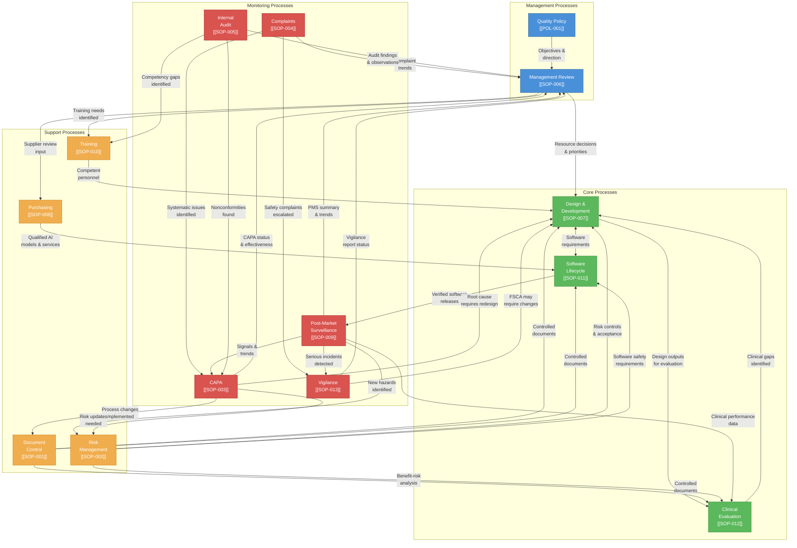

# Process Interaction Diagram

## 1. Purpose

This document provides a visual representation of how all QMS processes at Therapeak B.V. interact with each other. It demonstrates the process-based approach required by ISO 13485:2016 Clause 4.2.2 and shows the data flows between management, core, support, and monitoring processes.

**Related documents:** [[QM-001]] Quality Manual

## 2. Process Categories

| Category | Processes | Description |
|----------|-----------|-------------|
| **Management** | Management Review, Quality Policy | Strategic direction, resource allocation, QMS effectiveness evaluation |
| **Core** | Design and Development, Software Lifecycle, Clinical Evaluation | Value-creating processes that directly produce and validate the medical device |
| **Support** | Document Control, Training, Purchasing, Risk Management | Processes that enable and sustain core and monitoring processes |
| **Monitoring** | Post-Market Surveillance, CAPA, Complaints, Internal Audit, Vigilance | Processes that monitor performance, capture feedback, and drive improvement |

## 3. Process Interaction Diagram

## 4. Key Data Flows

### 4.1 Management Process Inputs

Management Review receives input from all monitoring processes and produces decisions that flow to core and support processes:

| Input Source | Data Provided |
|-------------|---------------|
| Post-Market Surveillance [[SOP-009]] | PMS Report summary, trend analysis, signals identified |
| CAPA [[SOP-003]] | Open/closed CAPAs, effectiveness of corrective actions |
| Complaints [[SOP-004]] | Complaint volumes, categorization, trends |
| Internal Audit [[SOP-005]] | Audit findings, nonconformities, observations |
| Vigilance [[SOP-013]] | Reportable incidents, field safety corrective actions |
| Quality Policy [[POL-001]] | Quality objectives, policy adequacy review |

### 4.2 Complaint-Driven Escalation Path

Complaints follow a defined escalation path through monitoring processes:

1. **Complaints** [[SOP-004]] — All user complaints are received and classified
2. **Vigilance** [[SOP-013]] — Safety complaints that meet serious incident criteria are immediately escalated
3. **CAPA** [[SOP-003]] — Systematic or recurring complaint patterns trigger corrective/preventive action
4. **Risk Management** [[SOP-002]] — CAPAs may require updates to the risk assessment
5. **Design and Development** [[SOP-007]] — Root causes requiring design changes are implemented through design controls

### 4.3 PMS Feedback Loop

Post-Market Surveillance drives continuous improvement across the QMS:

1. **PMS** [[SOP-009]] collects data from all defined sources (complaints, session quality flags, mood tracking, literature, Trustpilot)
2. Signals feed into **CAPA** [[SOP-003]] for systematic issues
3. Serious incidents feed into **Vigilance** [[SOP-013]] for regulatory reporting
4. Clinical performance data feeds into **Clinical Evaluation** [[SOP-012]] for benefit-risk updates
5. New hazards feed into **Risk Management** [[SOP-002]] for risk assessment updates
6. Summary and trends feed into **Management Review** [[SOP-006]] for strategic decisions

### 4.4 Support Process Dependencies

All core and monitoring processes depend on support processes:

| Support Process | Provided To | What It Provides |
|----------------|-------------|-----------------|
| Document Control [[SOP-001]] | All processes | Controlled documents, version management, change records |
| Training [[SOP-010]] | All processes | Competent personnel capable of executing procedures |
| Purchasing [[SOP-008]] | Software Lifecycle, Design and Development | Qualified suppliers, approved AI models, evaluated services |
| Risk Management [[SOP-002]] | Design and Development, Software Lifecycle, Clinical Evaluation | Risk controls, safety requirements, benefit-risk analysis |

### 4.5 Technical Documentation Outputs

The core and support processes produce the following key technical documentation deliverables:

| Process | Key Outputs |
|---------|-------------|
| Design and Development [[SOP-007]] | Use Requirements [[SPE-003]], Software Requirements [[SPE-001]], Product Specification [[SPE-002]], Design Review Records |
| Software Lifecycle [[SOP-011]] | Software Development Plan [[PLN-005]], Verification Test Specs [[TST-001]], Software Release Record [[RPT-005]] |
| Risk Management [[SOP-002]] | Risk Management Plan [[PLN-001]], Risk Management File [[RA-001]], Risk Management Report [[RPT-002]] |
| Clinical Evaluation [[SOP-012]] | Clinical Evaluation Plan [[PLN-002]], Clinical Evaluation Report [[CE-001]], PMCF Plan [[PLN-003]] |
| Document Control [[SOP-001]] | Traceability Matrix [[TRC-001]], GSPR Checklist [[CHK-001]] |

## 5. Change History

| Version | Date | Description |
|---------|------|-------------|
| 1.0 | 2026-03-01 | Initial release |
| 1.1 | 2026-04-01 | Added Section 4.5 (Technical Documentation Outputs) referencing new documents from April rebuild |

## 6. References

- [[QM-001]] Quality Manual
- [[SOP-001]] Document Control Procedure
- [[SOP-003]] CAPA Procedure
- [[SOP-004]] Complaint Handling Procedure
- [[SOP-006]] Management Review Procedure
- [[SOP-002]] Risk Management Procedure
- [[SOP-007]] Design and Development Procedure
- [[SOP-008]] Purchasing and Supplier Control Procedure
- [[SOP-009]] Post-Market Surveillance Procedure
- [[SOP-010]] Training and Competency Procedure
- [[SOP-011]] Software Lifecycle Procedure
- [[SOP-012]] Clinical Evaluation Procedure
- [[SOP-013]] Vigilance Procedure
- [[SOP-005]] Internal Audit Procedure
- [[POL-001]] Quality Policy
- ISO 13485:2016 Clause 4.2.2
