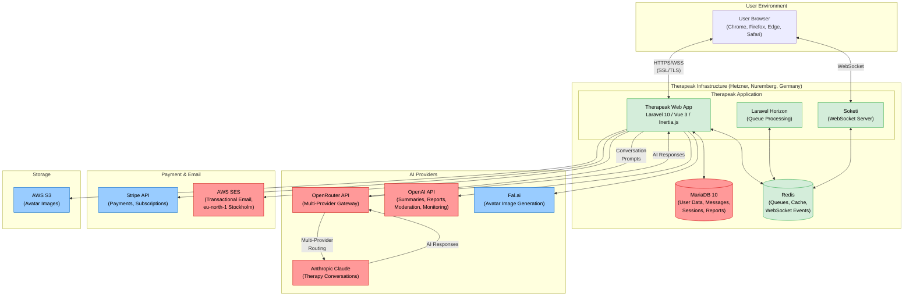
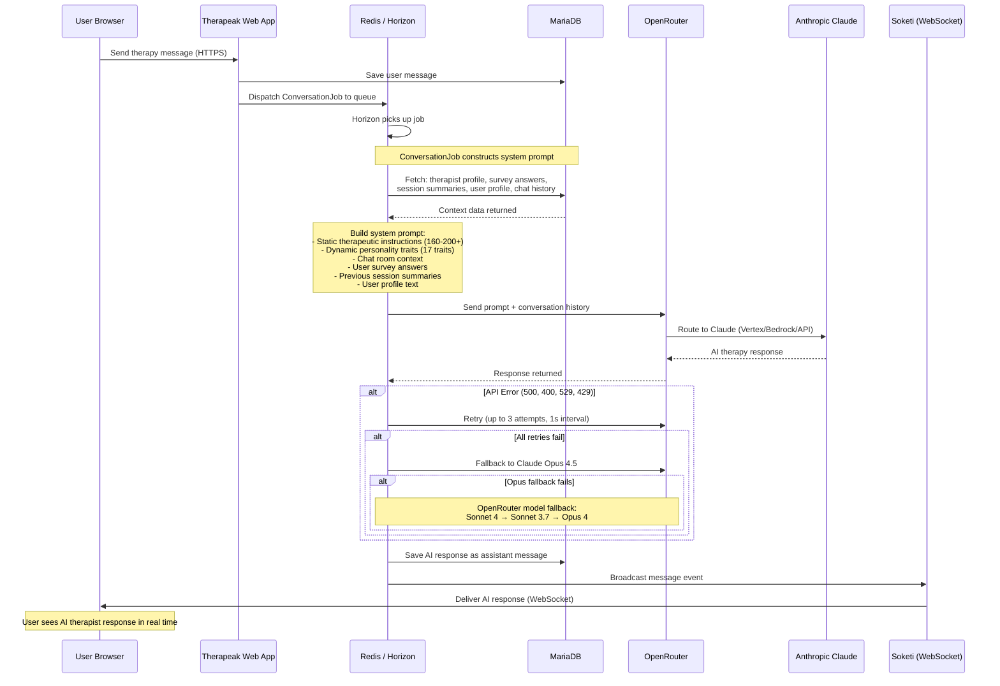
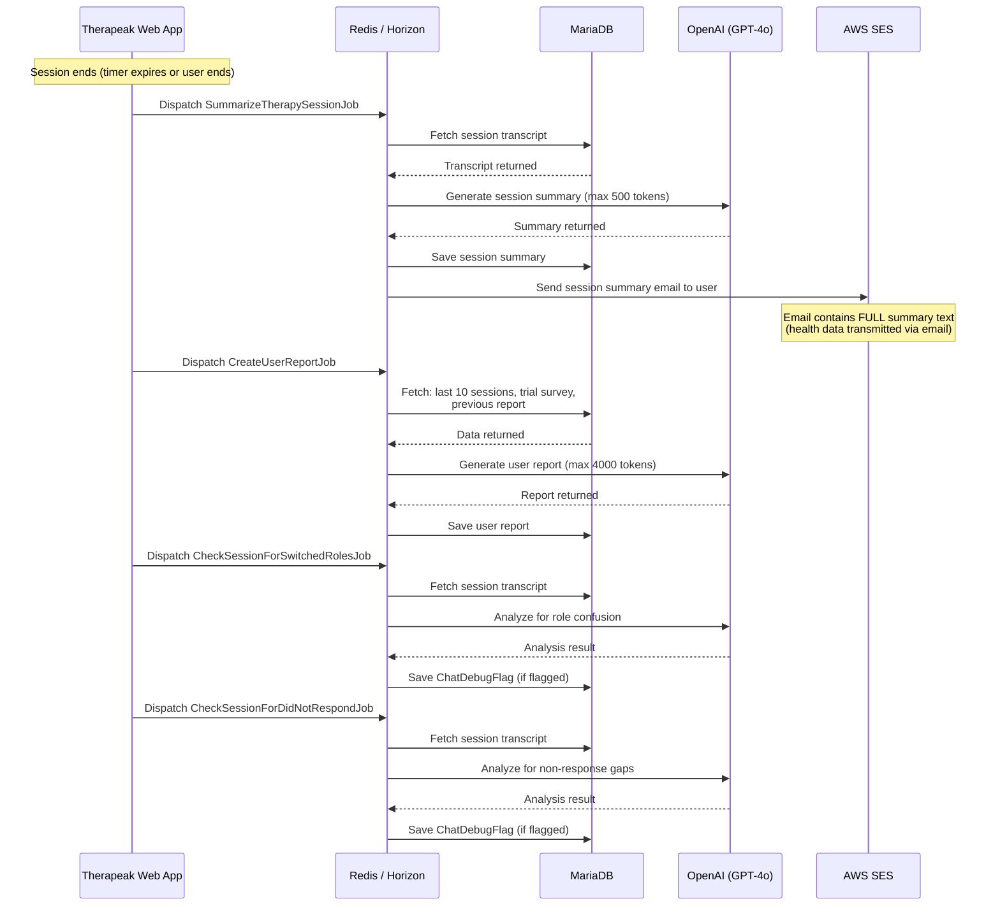
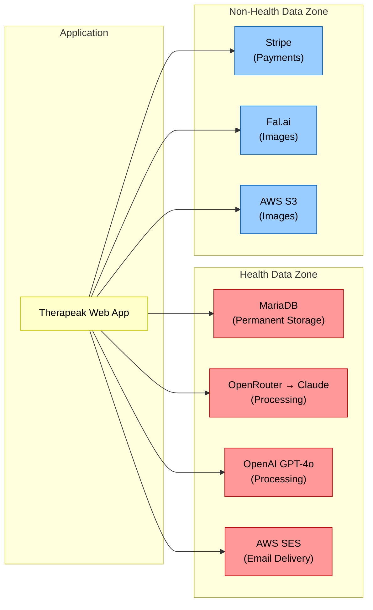

# Software Architecture Diagram

## 1. Purpose

This document provides the software architecture diagram for the Therapeak medical device (software version 1.0). It illustrates the system components, external interfaces, data flows, and the boundary between health data and non-health data processing.

## 2. System Architecture Overview

**Legend:**
- Red nodes: Components that process or store **health data** (therapy conversations, session summaries, reports, mood data, screening results)
- Blue nodes: Components that process **non-health data only** (payments, avatar images, file storage)
- Green nodes: Infrastructure components (application logic, queues, real-time messaging)

## 3. Data Flow: Therapy Session

The following diagram illustrates the complete data flow for a single therapy session message exchange.

## 4. Data Flow: Post-Session Processing

## 5. Health Data vs Non-Health Data Flow

The following table clarifies which external interfaces handle health data and which do not.

| Interface | Health Data | Data Description |
|---|---|---|
| **OpenRouter / Anthropic Claude** | Yes | Therapy conversation prompts and responses containing user messages, system instructions with survey data and session context |
| **OpenAI (GPT-4o)** | Yes | Session transcripts for summary generation, report generation, and session quality monitoring |
| **OpenAI (GPT-3.5-turbo)** | No | Platform content moderation only (reviews, survey replies, article replies) — NOT therapy messages |
| **AWS SES** | Yes | Session summary emails contain full therapy summary text in the email body |
| **MariaDB** | Yes | All user data, therapy messages, session summaries, reports, mood ratings, survey responses |
| **Redis** | Transient | Queue payloads containing therapy messages (transient, not persisted long-term) |
| **Stripe** | No | Payment and subscription data only |
| **Fal.ai** | No | Avatar image generation prompts and images only |
| **AWS S3** | No | Avatar images only |

### 5.1 Health Data Boundary

## 6. Infrastructure Components

| Component | Role | Technology |
|---|---|---|
| **Therapeak Web App** | Main application serving the user interface and orchestrating all backend operations | PHP 8.2 / Laravel 10 / Vue 3 / Inertia.js |
| **MariaDB 10** | Primary data store for all user data, therapy messages, sessions, reports, and surveys | Relational database |
| **Redis** | Queue broker (for Horizon job processing), cache layer, and WebSocket event transport | In-memory data store |
| **Laravel Horizon** | Queue worker that processes all asynchronous jobs including conversation jobs, summary generation, report generation, and monitoring jobs | Laravel queue dashboard/manager |
| **Soketi** | Self-hosted WebSocket server enabling real-time delivery of AI therapy responses to the user browser | Pusher-compatible WebSocket server |
| **Vite 4** | Frontend build tool | JavaScript bundler |

## 7. Revision History

| Version | Date | Author | Description |
|---|---|---|---|
| 1.0 | 2026-03-01 | Sarp Derinsu | Initial release |
