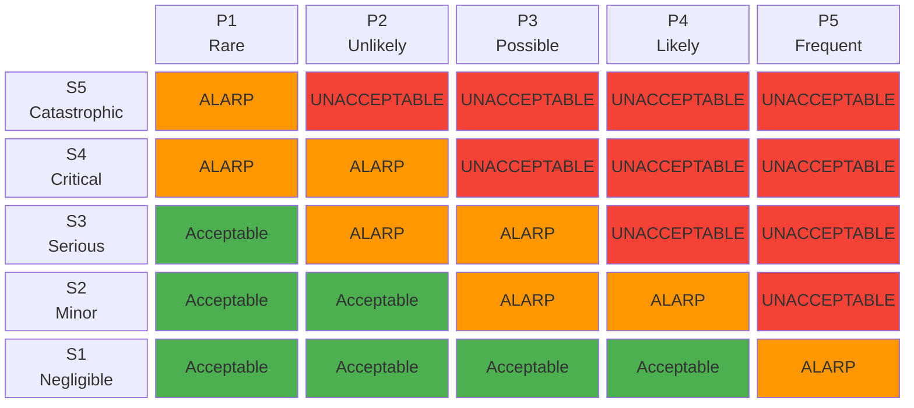

# Risk Management Plan

## 1. Purpose

This plan defines the risk management process for the Therapeak AI therapy platform throughout its entire lifecycle, in accordance with ISO 14971:2019 and EU MDR 2017/745. It establishes the criteria for risk acceptability, the methods for identifying and evaluating risks, and the process for implementing and verifying risk control measures.

As Therapeak is an AI-powered medical device software (MDSW) classified as Class IIa under Rule 11, this plan addresses risks specific to AI/ML-based therapy systems, including model output quality, role confusion, inappropriate therapeutic advice, data privacy, and system availability.

## 2. Scope

This plan applies to the Therapeak medical device (software version 1.0, `DEVICE_MODE=medical`) and covers all stages of the device lifecycle:

- Design and development
- Verification and validation
- Production (deployment and operation)
- Post-production (monitoring, updates, decommissioning)

The plan covers all hazards associated with:

- The AI therapy chatbot and its conversational outputs
- The underlying software platform (web application, database, infrastructure)
- User interaction with the device (usability-related risks)
- Data processing and privacy
- Third-party services and SOUP components

## 3. Risk Management Activities

| Activity | Responsibility | Timing | Output |
|---|---|---|---|
| Hazard identification | Sarp Derinsu | Design phase, and upon each change | Hazard list in [[RA-001]] |
| Risk estimation | Sarp Derinsu | Design phase, and upon each change | Risk matrix in [[RA-001]] |
| Risk evaluation | Sarp Derinsu | Before release, after each change | Risk evaluation in [[RA-001]] |
| Risk control implementation | Sarp Derinsu | Before release | Documented controls in [[RA-001]] |
| Risk control verification | Sarp Derinsu | Before release | Verification evidence in [[RA-001]] |
| Residual risk evaluation | Sarp Derinsu | Before release | Overall residual risk assessment |
| Benefit-risk determination | Sarp Derinsu | Before release | Benefit-risk analysis in [[RA-001]] |
| Post-market risk monitoring | Sarp Derinsu | Ongoing (continuous) | Updated [[RA-001]], PMS reports |
| Risk management review | Sarp Derinsu | At least annually, and before release | Risk management review record |

## 4. Risk Acceptability Criteria

### 4.1 Severity Levels

| Level | Category | Definition |
|---|---|---|
| S1 | Negligible | No injury or discomfort. Temporary inconvenience only. |
| S2 | Minor | Temporary discomfort or mild distress. Self-resolving without intervention. |
| S3 | Serious | Significant distress requiring professional intervention. Exacerbation of existing symptoms lasting days to weeks. |
| S4 | Critical | Severe psychological harm requiring emergency or sustained clinical intervention. Significant and prolonged worsening of mental health. |
| S5 | Catastrophic | Death or irreversible severe harm (e.g., self-harm resulting from device failure to escalate a crisis). |

### 4.2 Probability Levels

| Level | Category | Definition |
|---|---|---|
| P1 | Rare | Less than 1 in 100,000 sessions |
| P2 | Unlikely | 1 in 10,000 to 1 in 100,000 sessions |
| P3 | Possible | 1 in 1,000 to 1 in 10,000 sessions |
| P4 | Likely | 1 in 100 to 1 in 1,000 sessions |
| P5 | Frequent | Greater than 1 in 100 sessions |

### 4.3 Risk Acceptability Matrix

| Severity / Probability | P1 Rare | P2 Unlikely | P3 Possible | P4 Likely | P5 Frequent |
|---|---|---|---|---|---|
| **S5 Catastrophic** | ALARP | Unacceptable | Unacceptable | Unacceptable | Unacceptable |
| **S4 Critical** | ALARP | ALARP | Unacceptable | Unacceptable | Unacceptable |
| **S3 Serious** | Acceptable | ALARP | ALARP | Unacceptable | Unacceptable |
| **S2 Minor** | Acceptable | Acceptable | ALARP | ALARP | Unacceptable |
| **S1 Negligible** | Acceptable | Acceptable | Acceptable | Acceptable | ALARP |

#### Visual Risk Matrix

### 4.4 Risk Acceptability Definitions

- **Acceptable:** Risk is broadly acceptable. No further risk reduction required, though improvements may still be considered.
- **ALARP (As Low As Reasonably Practicable):** Risk shall be reduced as far as reasonably practicable. A documented justification is required demonstrating that the cost or technical difficulty of further reduction is grossly disproportionate to the benefit. The residual risk must be accepted through benefit-risk analysis.
- **Unacceptable:** Risk is not acceptable under any circumstances. The hazard must be eliminated or the risk must be reduced to ALARP or Acceptable through design changes, protective measures, or information for safety.

## 5. Risk Control Priorities

Per EU MDR 2017/745 Annex I, Section 4, risk control measures shall be applied in the following order of priority:

1. **Inherently safe design and manufacture** -- Eliminate or reduce risks through safe design (e.g., prompt engineering to prevent harmful outputs, age gating to prevent minor access, safety instructions embedded in AI system prompts).
2. **Adequate protection measures** -- Including alarms and automated safeguards where appropriate (e.g., session quality monitoring via ChatDebugFlags, role confusion detection, content moderation, crisis resource display).
3. **Information for safety** -- Warnings, training materials, and instructions for use (e.g., disclaimers that Therapeak is not for crisis use, IFU statements, homepage emergency messaging).

## 6. Risk Analysis Methods

### 6.1 Failure Mode and Effects Analysis (FMEA)

The primary systematic risk analysis method is FMEA, applied to:

- AI model outputs (therapeutic conversation, session summaries, user reports)
- Software functions (session management, data processing, authentication)
- Third-party service dependencies (Anthropic, OpenRouter, Stripe, Hetzner)
- User interface interactions (chat interface, mood tracking, report viewing)
- Data handling (storage, transmission, deletion)

Each failure mode is assessed for severity, probability of occurrence, and detectability. Risk Priority Numbers (RPNs) are used to prioritize risk control activities within each risk level category.

### 6.2 AI-Specific Risk Categories

The following AI-specific risk categories shall be systematically analyzed:

| Risk Category | Description | Examples |
|---|---|---|
| Model output quality | AI generates therapeutically inappropriate, inaccurate, or unhelpful content | Generic advice, factually incorrect coping strategies, culturally insensitive responses |
| Role confusion | AI deviates from therapist role | AI responds as the patient, breaks character, discusses its own nature as AI in ways that undermine therapeutic alliance |
| Inappropriate therapeutic advice | AI provides advice outside intended scope | Suggesting medication changes, providing diagnoses, advising on crisis situations beyond escalation |
| Data privacy | Unauthorized access to or misuse of health data | Data breach, unintended data retention by third-party AI providers, session data in emails |
| System availability | Service disruption preventing user access | AI provider outage, server downtime, queue processing failure (Horizon) |
| Prompt injection | User manipulates AI through adversarial inputs | User attempts to override system prompt, extract instructions, or manipulate AI behavior |
| Model drift/change | AI behavior changes due to upstream model updates | Anthropic updates Claude behavior, infrastructure routing changes |
| Bias and fairness | AI outputs differ systematically across user populations | Different quality of therapeutic support based on language, cultural background, or condition type |

## 7. Risk Management File

All risk management activities, analyses, evaluations, and control measures are documented in the Risk Management File [[RA-001]], which includes:

- This Risk Management Plan (PLN-001)
- Hazard identification and risk analysis records (FMEA worksheets)
- Risk evaluation results
- Risk control measures and verification records
- Residual risk evaluation
- Benefit-risk analysis
- Risk management review records
- Post-market risk monitoring updates

## 8. Production and Post-Production Information

Risk management continues throughout the post-production phase. Sources of post-production information include:

- User complaints (email and contact form)
- Session quality monitoring (ChatDebugFlags: FLAG_SWITCHED_ROLES, FLAG_DID_NOT_RESPOND)
- Mood tracking data and user retention analytics
- Trustpilot reviews
- Telescope monitoring (system errors, performance)
- Literature monitoring for new safety information
- Regulatory updates (MDCG guidance, harmonized standards)

When new hazards or changed risk estimates are identified from post-production data, the risk management file [[RA-001]] shall be updated and the impact on existing risk controls re-evaluated per [[SOP-002]].

## 9. Criteria for Risk Management Review

A formal risk management review shall be conducted:

- Before initial market release (CE marking)
- At least annually thereafter
- When significant changes are made to the device
- When new post-market safety information triggers a review

The review shall confirm that:

- The risk management plan has been appropriately implemented
- The overall residual risk is acceptable
- Appropriate methods are in place to collect post-production information

## 10. Timeline

| Milestone | Target Date |
|---|---|
| Risk management plan approved | 2026-03-01 |
| Initial hazard identification and FMEA complete | Before NB Stage 1 (April 2026) |
| Risk controls implemented and verified | Before CE marking |
| First post-market risk review | 12 months after market placement |
| Ongoing risk monitoring | Continuous |

## 11. References

- [[RA-001]] Risk Management File
- [[SOP-002]] Risk Management Procedure
- ISO 14971:2019 Medical devices -- Application of risk management to medical devices
- ISO/TR 24971:2020 Guidance on the application of ISO 14971
- EU MDR 2017/745 Annex I (General Safety and Performance Requirements)
- EU MDR 2017/745 Article 10(2) (Risk management obligations)
- IEC 62304:2006+A1:2015 (Software lifecycle risk management)
- MDCG 2019-16 Guidance on cybersecurity for medical devices
