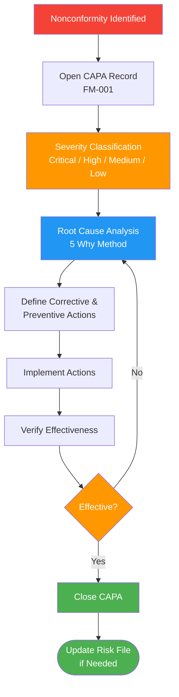

# CAPA Procedure

## 1. Purpose

This procedure defines the process for identifying, investigating, and resolving corrective and preventive actions (CAPA) to eliminate the causes of actual or potential nonconformities and prevent their recurrence or occurrence. It is designed to be practical for a one-person operation while meeting the requirements of [Clause 8.5.2](/references/iso-13485#clause-8-5-2) and [Clause 8.5.3](/references/iso-13485#clause-8-5-3).

**Related documents:** [[SOP-001]] Document Control, [[FM-001]] CAPA Form

## 2. Scope

This procedure applies to all nonconformities and potential nonconformities identified through:
- Customer complaints ([[SOP-004]])
- Internal and external audits ([[SOP-005]])
- Post-market surveillance data ([[SOP-010]])
- Management review
- Risk management activities ([[SOP-002]])
- Regulatory changes or NB findings
- Self-identified issues during daily operations

## 3. Responsibilities

| Role | Person | Responsibility |
|------|--------|---------------|
| CAPA Owner | Sarp Derinsu | Identifies issues, investigates root cause, defines and implements actions, verifies effectiveness, closes CAPAs |
| Regulatory Advisor | Suzan Slijpen (Pander Consultancy) | Advises on regulatory implications of CAPAs, reviews critical/high severity CAPAs |

## 4. Procedure

### Process Flow

### 4.1 CAPA Initiation

When a nonconformity or potential nonconformity is identified:

1. Create a CAPA record using [[FM-001]] on the QMS platform
2. The platform assigns a unique record number (e.g., FM-001-REC-001)
3. Document:
   - Source of the issue (complaint, audit finding, PMS data, etc.)
   - Description of the actual or potential nonconformity
   - Initial severity assessment (see 4.2)
   - Immediate containment action taken, if any
4. For Critical severity: notify Suzan Slijpen within 24 hours for regulatory assessment

### 4.2 Severity Classification

| Severity | Criteria | Investigation Deadline | Resolution Deadline |
|----------|----------|----------------------|---------------------|
| Critical | Patient safety risk, possible serious incident, regulatory non-compliance | Start within 24 hours | 30 days |
| High | Significant quality impact, recurring issue, NB finding | Start within 5 days | 60 days |
| Medium | Minor quality impact, isolated incident | Start within 15 days | 90 days |
| Low | Observation, improvement opportunity | Start within 30 days | 120 days |

These timelines are realistic for a one-person company. If a deadline cannot be met, document the reason and revised target date in the CAPA record. Critical CAPAs affecting patient safety always take priority over all other work.

### 4.3 Root Cause Analysis

For each CAPA, perform root cause analysis proportionate to the severity:

1. **Gather evidence** — Collect relevant data: complaint details, logs, session transcripts, screenshots, audit findings
2. **Apply 5 Why analysis** — Ask "why" iteratively until the root cause is identified. For most issues at Therapeak, 3-5 iterations are sufficient.
3. **Document the root cause** in the CAPA record
4. **Assess scope** — Determine whether the root cause could affect other areas (e.g., if a prompt issue affects one language, check others)

For Critical or High severity CAPAs, document the 5 Why chain explicitly in the CAPA record. For Medium and Low, a brief root cause statement is sufficient.

### 4.4 Action Definition

Based on the root cause:

1. **Corrective action** — Action to eliminate the cause of the detected nonconformity (e.g., fix the code, update the prompt, change the process)
2. **Preventive action** — Action to prevent recurrence or occurrence of similar issues (e.g., add automated monitoring, add a checklist step, update a procedure)
3. For each action, define:
   - Specific description of what will be done
   - Target completion date
   - How effectiveness will be verified
4. Assess whether proposed actions could affect product safety or introduce new risks. If so, update [[RA-001]] per [[SOP-002]]

For Critical and High severity: consult Suzan Slijpen before finalizing actions to confirm regulatory adequacy.

### 4.5 Implementation

1. Implement the defined corrective and preventive actions
2. For software changes: follow the standard development and deployment process
3. For document changes: follow [[SOP-001]]
4. Document what was done and when in the CAPA record
5. If implementation reveals the root cause was incorrect, return to 4.3

### 4.6 Effectiveness Verification

After implementation, verify that the actions were effective:

1. Define what "effective" means for this specific CAPA (e.g., no recurrence within 60 days, monitoring shows improvement, audit finding resolved)
2. Allow sufficient time for verification:
   - Process changes: minimum 30 days
   - Software fixes: confirm via testing and monitor for at least 2 weeks post-deployment
   - Document changes: verify at next applicable activity
3. Document the verification result in the CAPA record
4. If the actions were NOT effective, reopen the investigation and return to 4.3

### 4.7 Closure

1. Review the CAPA record for completeness:
   - Root cause documented
   - Actions defined and implemented
   - Effectiveness verified
   - All fields in [[FM-001]] completed
2. Close the CAPA record on the QMS platform
3. If the CAPA revealed a risk not previously identified, update [[RA-001]]
4. If the CAPA resulted in a process change, ensure the relevant SOP is updated

### 4.8 CAPA Trending and Review

CAPA trends are reviewed during management review (at minimum annually):
- Number of CAPAs opened and closed
- CAPAs by source (complaints, audits, PMS, etc.)
- CAPAs by severity
- Average time to closure
- Recurring root causes
- Overdue CAPAs

If trends indicate a systemic issue, initiate a new preventive CAPA to address the pattern.

## 5. Records

| Record | Retention | Reference |
|--------|-----------|-----------|
| CAPA Form (completed records) | Lifetime of device + 10 years | [[FM-001]] |
| Root cause analysis documentation | With CAPA record | — |
| Effectiveness verification evidence | With CAPA record | — |

## 6. References

- [[SOP-001]] Document Control Procedure
- [[SOP-002]] Risk Management Procedure
- [[SOP-004]] Complaint Handling Procedure
- [[SOP-005]] Internal Audit Procedure
- [[SOP-010]] Post-Market Surveillance Procedure
- [[FM-001]] CAPA Form
- [[RA-001]] Risk Management File
- [ISO 13485:2016 Clause 8.5.2](/references/iso-13485#clause-8-5-2) — Corrective Action
- [ISO 13485:2016 Clause 8.5.3](/references/iso-13485#clause-8-5-3) — Preventive Action
- [EU MDR 2017/745 Article 10(9)](/references/eu-mdr#article-10-general-obligations-of-manufacturers)
