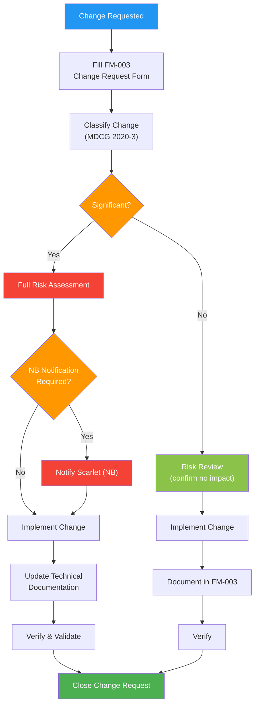

# Change Management Procedure

## 1. Purpose

This procedure defines how Therapeak B.V. evaluates, approves, implements, and documents changes to the Therapeak medical device software, ensuring that changes do not adversely affect product safety, performance, or regulatory compliance. This procedure complies with ISO 13485:2016 Clause 7.3.9 and EU MDR Article 10(9), and follows MDCG 2020-3 guidance on significant changes.

**Related documents:** [[FM-003]] Change Request Form, [[SOP-011]] Software Lifecycle Management, [[SOP-014]] Product Identification and Traceability, [[SOP-016]] Cybersecurity Management

## 2. Scope

This procedure applies to all changes to:
- The Therapeak medical device software (application code, AI prompts, configuration)
- AI models and AI pipeline components
- Infrastructure and deployment environment
- Technical documentation and labeling (IFU)
- Intended purpose or claims

This procedure does NOT apply to:
- Changes to QMS documents (governed by [[SOP-001]] Document Control)
- Changes to the wellness version that do not affect the medical device codebase

## 3. Responsibilities

| Role | Person | Responsibility |
|------|--------|---------------|
| Change Initiator / Evaluator / Approver | Sarp Derinsu | Initiates, evaluates significance, assesses risk, approves, implements, and verifies all changes |

## 4. Procedure

### Process Flow

### 4.1 Change Request

All proposed changes are documented using [[FM-003]] Change Request Form before implementation. The change request includes:

1. Description of the proposed change
2. Rationale (why the change is needed)
3. Affected components (code, prompts, models, infrastructure, documentation)
4. Significance classification (see Section 4.2)
5. Risk assessment summary
6. Planned verification/validation activities

For urgent safety-related changes (e.g., hotfixes for critical bugs), the change may be implemented first and documented retroactively within 48 hours, with justification recorded.

### 4.2 Significance Classification

Changes are classified as significant or non-significant per MDCG 2020-3 guidance.

#### 4.2.1 Significant Changes

A change is significant if it could affect the safety or performance of the device, or if it alters the basis on which the conformity assessment was carried out. Examples for Therapeak:

| Change | Why Significant |
|--------|----------------|
| AI model change where safety verification tests fail | New model does not demonstrate equivalent safety and performance |
| Changes to intended purpose | Alters the fundamental basis of the CE marking and conformity assessment |
| New therapeutic claims | Requires updated clinical evidence and risk assessment |
| Major architecture changes | May affect data flow, security, reliability, and validated state |
| New data processing that changes the risk profile | May introduce new hazards or change exposure to existing hazards |
| Changes to the classification rule or risk class | Regulatory impact |

#### 4.2.2 Non-Significant Changes

Changes that do not affect safety, performance, or the basis of conformity assessment. Examples for Therapeak:

| Change | Why Non-Significant |
|--------|---------------------|
| UI improvements (layout, styling, colors) | No impact on therapeutic function or safety |
| Bug fixes (non-safety) | Restores intended function without changing device behavior |
| Prompt refinements (minor wording improvements to existing therapeutic instructions) | Does not change therapeutic approach or safety behavior |
| Dependency updates (non-security, compatible versions) | No functional change |
| Performance optimizations | Same function, better efficiency |
| Localization/translation updates | Content adaptation, no therapeutic change |

### 4.3 Change Evaluation Process

#### 4.3.1 For All Changes

1. Review the change against the risk management file ([[RA-001]]) to determine if new hazards are introduced or existing risks are affected
2. Assess impact on verified/validated state
3. Determine required verification and validation activities
4. Document the evaluation in [[FM-003]]

#### 4.3.2 Additional Steps for Significant Changes

Significant changes require:

1. **Updated risk assessment**: full analysis of new or changed hazards, updated risk management file
2. **Notified Body notification**: inform Scarlet of the planned significant change and provide relevant documentation
3. **Updated technical documentation**: revise affected sections of the technical documentation
4. **Re-verification/re-validation**: perform testing proportionate to the scope of the change
5. **Updated labeling**: revise IFU if the change affects user-facing information
6. **Updated EUDAMED data**: if UDI-relevant information changes per [[SOP-014]]
7. **Version increment**: major version increment per [[SOP-014]] versioning scheme

Wait for Notified Body feedback before deploying significant changes to production, unless the change is urgently needed for patient safety (in which case, deploy and notify simultaneously).

#### 4.3.3 For Non-Significant Changes

Non-significant changes follow a streamlined process:

1. Document the change in [[FM-003]] (may use a simplified format)
2. Perform risk review (confirm no safety/performance impact)
3. Verify the change through appropriate testing
4. Deploy to production following the normal deployment process
5. Minor or patch version increment per [[SOP-014]]

### 4.4 Predetermined Change Control Plan for AI Model Updates

AI model changes are a recurring change managed under a predetermined change control plan. This plan pre-authorizes AI model changes — including switching providers — under defined conditions, avoiding the need for full significant change evaluation each time.

#### 4.4.1 Scope of Predetermined Changes

The following AI model changes are covered by this plan:

- Updating to a newer version within the same model family (e.g., Sonnet 4.5 to Sonnet 4.6)
- Switching between fallback models (as documented in the fallback configuration)
- Switching to a different AI model provider (e.g., Anthropic to OpenAI), provided all conditions in Section 4.4.2 are met
- Minor parameter adjustments (max tokens, temperature) within pre-defined ranges

#### 4.4.2 Conditions for Predetermined Changes

A predetermined AI model change may proceed without full significant change evaluation IF all of the following conditions are met:

1. The same therapeutic instructions and safety configuration are used
2. Initial testing with representative conversation scenarios shows equivalent or better therapeutic quality
3. Safety verification tests (crisis handling, role enforcement, content restrictions) all pass with the new model
4. No degradation in safety behavior during testing
5. Post-deployment monitoring for the first 7 days shows no increase in session quality flags or user complaints

#### 4.4.3 Predetermined Change Process

1. Document the planned model change in [[FM-003]] referencing this predetermined change control plan
2. Run safety verification tests (TS-012, TS-013, TS-015 from [[TST-001]])
3. Run representative conversation scenarios
4. Verify all conditions in Section 4.4.2 are met
5. Deploy to production (may use A/B testing with limited user exposure first)
6. Monitor for 7 days post-deployment
7. If any condition is not met, escalate to full significant change evaluation (Section 4.3.2)
8. Close the change request with monitoring results

#### 4.4.4 Changes NOT Covered

The following are NOT covered by the predetermined plan and require full significant change evaluation:

- Fundamental changes to the therapeutic approach or intended purpose
- Changes to the AI pipeline architecture (e.g., new intermediary service)
- Changes where the safety verification tests do not pass

### 4.5 Implementation and Verification

All changes are implemented through:

1. **Code changes**: committed to git with descriptive commit messages referencing the change request
2. **Testing**: appropriate to the scope (unit tests, integration tests, manual testing, A/B testing)
3. **Staging verification**: test in staging environment before production deployment (where applicable)
4. **Production deployment**: deploy following the standard deployment process
5. **Post-deployment verification**: confirm the change works as intended in production

### 4.6 Documentation and Traceability

Every change is traceable through:

| Element | How Tracked |
|---------|------------|
| Change request | [[FM-003]] Change Request Form with unique ID |
| Significance classification | Documented in [[FM-003]] |
| Risk assessment | Documented in [[FM-003]] and/or updated [[RA-001]] |
| Implementation | Git commits referencing the change request ID |
| Verification | Test records linked to the change request |
| Version | Git tag for the released version per [[SOP-014]] |

### 4.7 Change Review

During management review (at least annually), Sarp reviews:

1. All significant changes implemented since last review
2. Effectiveness of the predetermined change control plan
3. Any changes that required escalation from non-significant to significant
4. Trends in change requests (volume, types, outcomes)
5. Lessons learned from change-related issues

## 5. Records

| Record | Retention | Reference |
|--------|-----------|-----------|
| Change Request Forms | Lifetime of device + 10 years | [[FM-003]] |
| Risk assessments for changes | Lifetime of device + 10 years | -- |
| Verification/validation records for changes | Lifetime of device + 10 years | -- |
| NB notification correspondence (significant changes) | Lifetime of device + 10 years | -- |
| Predetermined change monitoring results | Lifetime of device + 10 years | -- |

## 6. References

- [[FM-003]] Change Request Form
- [[SOP-001]] Document Control Procedure
- [[SOP-011]] Software Lifecycle Management Procedure
- [[SOP-014]] Product Identification and Traceability Procedure
- [[SOP-016]] Cybersecurity Management Procedure
- [[RA-001]] Risk Management File
- ISO 13485:2016 Clause 7.3.9 — Design and Development Changes
- EU MDR 2017/745 Article 10(9)
- MDCG 2020-3 — Guidance on Significant Changes
