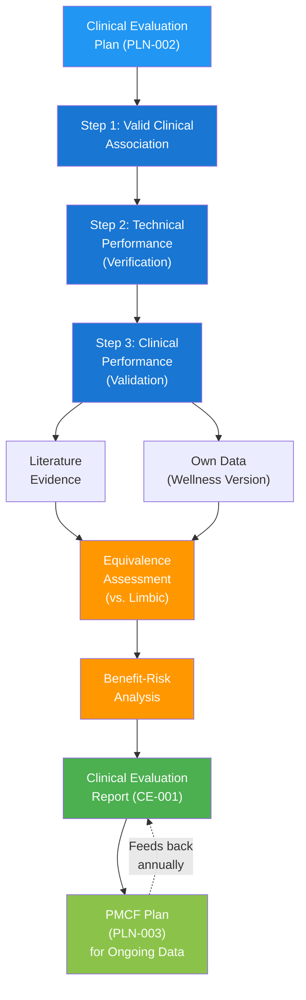

# Clinical Evaluation Procedure

## 1. Purpose

This procedure defines how Therapeak B.V. conducts and maintains the clinical evaluation of the Therapeak medical device software. The clinical evaluation demonstrates that the device achieves its intended clinical benefits, that undesirable side effects are acceptable when weighed against the benefits, and that the device performs as claimed. The procedure follows the methodology outlined in MDCG 2020-1 (Guidance on Clinical Evaluation of Medical Device Software).

**Related documents:** [[PLN-002]] Clinical Evaluation Plan, [[CE-001]] Clinical Evaluation Report, [[PLN-003]] PMCF Plan

## 2. Scope

This procedure applies to:
- The initial clinical evaluation of the Therapeak AI therapy medical device software (Class IIa, Rule 11) prior to CE marking
- Ongoing clinical evaluation updates throughout the device's lifetime
- Literature search and appraisal
- Identification and appraisal of clinical evidence
- Equivalence assessment
- Benefit-risk analysis
- Clinical performance demonstration following the MDCG 2020-1 pathway

## 3. Responsibilities

| Role | Person | Responsibility |
|------|--------|---------------|
| Clinical Evaluation Author | Sarp Derinsu | Conducts literature searches, appraises evidence, writes and maintains the CER |
| Regulatory Consultant | Suzan Slijpen | Reviews clinical evaluation methodology and CER; advises on regulatory expectations |
| Notified Body | Scarlet | Reviews and assesses the clinical evaluation as part of conformity assessment |

## 4. Procedure

### Process Flow



### 4.1 Clinical Evaluation Pathway (MDCG 2020-1)

As a Medical Device Software (MDSW), the clinical evaluation follows the three-step pathway defined in MDCG 2020-1:

```
Step 1: Valid Clinical Association
   → Demonstrate that the device's output (conversational guidance for mental health
      self-management) is associated with the target clinical condition
      (mild-to-moderate anxiety, depression, stress-related disorders)

Step 2: Technical Performance (Verification)
   → Demonstrate that the software generates accurate, reliable, and safe outputs
      under the conditions of its intended use

Step 3: Clinical Performance (Validation)
   → Demonstrate that the device achieves clinically meaningful outcomes for
      the target patient population in the intended use environment
```

Each step is documented in the Clinical Evaluation Report [[CE-001]].

### 4.2 Literature Search

#### 4.2.1 Search Strategy

A systematic literature search is conducted to identify relevant clinical evidence. The search strategy includes:

| Parameter | Details |
|-----------|---------|
| Databases | PubMed, Google Scholar, Cochrane Library, IEEE Xplore, PsycINFO |
| Search terms | AI therapy, AI chatbot mental health, conversational AI depression, conversational AI anxiety, digital mental health intervention, AI-guided self-management, MDSW clinical evaluation |
| Time period | 2018 to present (updated at each CER revision) |
| Languages | English |
| Inclusion criteria | RCTs, controlled studies, systematic reviews, meta-analyses of AI/chatbot-based mental health interventions in adults |
| Exclusion criteria | Studies on populations under 18, non-conversational digital interventions, studies without clinical outcome measures |

#### 4.2.2 Literature Appraisal

Each identified publication is appraised for:

1. **Relevance:** Does the study evaluate a device/intervention comparable to Therapeak's intended purpose?
2. **Methodological quality:** Study design, sample size, outcome measures, statistical rigor, bias risk
3. **Data contribution:** What does the study contribute to the valid clinical association, technical performance, or clinical performance arguments?

Literature appraisal results are documented in a structured table within [[CE-001]].

### 4.3 Clinical Evidence Sources

The clinical evaluation draws on the following evidence categories:

#### 4.3.1 Published Clinical Data

Key published evidence includes (non-exhaustive; updated with each CER revision):

| Source | Type | Relevance |
|--------|------|-----------|
| Therabot studies (e.g., Stade et al.) | RCT | AI therapy chatbot for depression/anxiety; demonstrates efficacy of conversational AI for mental health |
| Woebot studies (e.g., Fitzpatrick et al.) | RCT | CBT-based chatbot for depression; early evidence of AI chatbot effectiveness |
| Friend chatbot studies | RCT | AI companion chatbot for mental health; evidence of conversational AI impact on user wellbeing |
| Meta-analyses of digital mental health interventions | Systematic review | Aggregate evidence of effectiveness of digital/AI-based mental health tools |

#### 4.3.2 Equivalent Device Data

Equivalence is assessed against comparable devices, with Limbic as the key comparator:

| Comparator | Justification |
|-----------|---------------|
| **Limbic** | Class IIa CE-marked AI mental health chatbot under EU MDR; most directly comparable device on the EU market. Uses AI conversational interface for mental health support. |

Equivalence is assessed across three dimensions per Annex XIV:

| Dimension | Limbic vs. Therapeak |
|-----------|---------------------|
| **Clinical** | Same intended purpose (AI-guided mental health support for mild-to-moderate conditions), same target population (adults), same clinical conditions (anxiety, depression) |
| **Technical** | Both use AI/NLP for conversational interaction; differences in underlying models (proprietary vs. Claude/Anthropic) and therapeutic approach are documented and assessed |
| **Biological** | Not applicable (software device, no patient contact) |

Where full equivalence cannot be claimed (e.g., different AI models, different therapeutic methodologies), the gaps are identified and addressed through additional clinical evidence and PMCF activities per [[PLN-003]].

#### 4.3.3 Pre-Market Data from Wellness Version

The Therapeak wellness version (device_mode=wellness) provides pre-market experience data:

| Data Type | Details |
|-----------|---------|
| User base | Few hundred subscribers |
| Safety record | No reported serious adverse events or harm |
| User complaints | Complaint types and frequencies documented |
| Session quality | FLAG_SWITCHED_ROLES and FLAG_DID_NOT_RESPOND rates |
| Mood tracking | Aggregate mood trend data (user self-reported and AI-assessed) |
| User retention | Subscription and engagement metrics |

This pre-market data is not a substitute for clinical evidence from published studies but supplements the clinical evaluation by demonstrating real-world usability and safety in a comparable user population.

### 4.4 Valid Clinical Association (Step 1)

The valid clinical association is established by demonstrating:

1. Published literature supports that conversational AI interventions (chatbots) can have a positive impact on mild-to-moderate anxiety and depression symptoms
2. The therapeutic techniques embedded in Therapeak's prompts (empathetic listening, coping strategies, CBT-informed approaches, mood monitoring) are recognized in clinical practice
3. Established outcome measures (PHQ-9, GAD-7) are used in published studies to demonstrate this association
4. The IMDRF classification ("informs clinical management") is consistent with the clinical evidence base

### 4.5 Technical Performance (Step 2)

Technical performance is demonstrated through:

1. **Output accuracy and reliability:** AI response quality monitoring (manual review + automated ChatDebugFlag analysis)
2. **Safety mechanisms:** Prompt-based safety instructions (160-200+ embedded instructions), role enforcement, crisis redirection to Claude's built-in safety, content restrictions
3. **System reliability:** 99.9% uptime target, multi-provider infrastructure redundancy (Vertex AI, Bedrock, Anthropic API via OpenRouter gateway), retry logic
4. **Verification testing:** Prompt testing via `routes/prompt-testing.php`, manual session review, session quality flag monitoring
5. **Data from wellness version:** Rates of FLAG_SWITCHED_ROLES and FLAG_DID_NOT_RESPOND events, complaint rates, system error rates

### 4.6 Clinical Performance (Step 3)

Clinical performance is demonstrated through:

1. **Published RCTs on comparable devices:** Therabot, Woebot, and Friend chatbot studies demonstrating clinical outcomes (symptom reduction) with AI conversational interventions
2. **Equivalence argument:** Limbic (CE-marked Class IIa device) provides evidence that AI mental health chatbots can achieve sufficient clinical performance for MDR conformity
3. **Pre-market mood data:** Aggregate mood trends from the wellness version showing user trajectories
4. **PMCF plan:** [[PLN-003]] defines proactive post-market clinical follow-up to generate additional clinical performance data specific to Therapeak

### 4.7 Benefit-Risk Analysis

The clinical evaluation includes a benefit-risk analysis that weighs:

**Benefits:**
- Accessible mental health support without waitlists or geographic barriers
- 24/7 availability for self-management of mild-to-moderate symptoms
- Personalized conversational guidance adapted to user's reported concerns
- Mood tracking and session reports that users can share with healthcare professionals
- Low-barrier entry point for individuals who may not seek traditional therapy

**Risks (and mitigations):**
- Inappropriate or harmful AI guidance → mitigated by 160-200+ safety instructions, role enforcement, crisis handling via Claude built-in safety, session quality monitoring
- User over-reliance / delay in seeking professional help → mitigated by disclaimers, IFU, recommendation to use as supplement to (not replacement for) professional care
- Role confusion (AI acting as patient) → mitigated by FLAG_SWITCHED_ROLES monitoring and prompt reinforcement
- Privacy/data breach → mitigated by server security, access controls, data retention policies
- Device unavailability during user need → mitigated by multi-provider fallback, 99.9% uptime target

The benefit-risk analysis concludes that the residual risks are acceptable when weighed against the clinical benefits, given the mitigations in place. Full analysis is documented in [[CE-001]].

### 4.8 Clinical Evaluation Report (CER)

The CER [[CE-001]] documents the complete clinical evaluation and is structured to include:

1. Device description and intended purpose
2. Clinical evaluation scope and methodology
3. Literature search strategy and results
4. Literature appraisal
5. Equivalence assessment
6. Valid clinical association evidence (Step 1)
7. Technical performance evidence (Step 2)
8. Clinical performance evidence (Step 3)
9. Benefit-risk analysis
10. Conclusions
11. PMCF recommendations
12. Date and signature

### 4.9 CER Updates

The CER is a living document and must be updated:

| Trigger | Action |
|---------|--------|
| At least annually | Scheduled review and update with latest PMS data, literature, and clinical evidence |
| New clinical data available | Unscheduled update if new evidence materially affects the clinical evaluation conclusions |
| Significant device changes | Update if changes to intended purpose, target population, or core AI functionality |
| PMCF results | Incorporate PMCF findings into the CER |
| Post-market surveillance signals | Update benefit-risk analysis if new risks or changed risk levels are identified |

Each CER update follows the document control process per [[SOP-001]], with version increment and approval.

### 4.10 Relationship to PMCF

The clinical evaluation identifies gaps in clinical evidence that require post-market clinical follow-up. These gaps are documented in the CER and addressed through the PMCF Plan [[PLN-003]]. PMCF activities may include:
- Structured collection of user outcome data (mood tracking trends, session engagement)
- User surveys on perceived clinical benefit
- Analysis of complaint and safety data for clinical performance signals
- Literature surveillance for new publications on AI mental health interventions

PMCF results feed back into the CER at each update cycle.

## 5. Records

| Record | Retention | Reference |
|--------|-----------|-----------|
| Clinical Evaluation Report | Lifetime of device + 10 years | [[CE-001]] |
| Clinical Evaluation Plan | Lifetime of device + 10 years | [[PLN-002]] |
| Literature search records | Lifetime of device + 10 years | Within CER |
| Literature appraisal tables | Lifetime of device + 10 years | Within CER |
| Equivalence assessment | Lifetime of device + 10 years | Within CER |

## 6. References

- [[PLN-002]] Clinical Evaluation Plan
- [[CE-001]] Clinical Evaluation Report
- [[PLN-003]] PMCF Plan
- [[SOP-001]] Document Control Procedure
- [[SOP-009]] Post-Market Surveillance Procedure
- MDCG 2020-1 — Guidance on Clinical Evaluation (MDSw) — Software as a Medical Device
- EU MDR 2017/745 Article 61 — Clinical Evaluation
- EU MDR 2017/745 Annex XIV — Clinical Evaluation and Post-Market Clinical Follow-Up
- ISO 13485:2016 Clause 7.3.7 — Design and Development Validation
- MEDDEV 2.7/1 Rev. 4 — Clinical Evaluation: A Guide for Manufacturers and Notified Bodies
