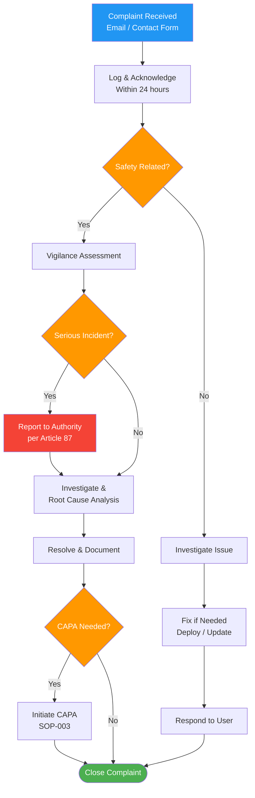

# Complaint Handling Procedure

## 1. Purpose

This procedure defines how customer complaints are received, evaluated, investigated, and resolved for the Therapeak medical device. It ensures complaints are handled promptly and that any complaint indicating a potential serious incident is escalated to vigilance reporting, in accordance with [Clause 8.2.2](/references/iso-13485#clause-8-2-2) and [Article 87](/references/eu-mdr#article-87-reporting-of-serious-incidents-and-field-safety-corrective-actions).

**Related documents:** [[FM-004]] Complaint Form, [[SOP-013]] Vigilance Procedure, [[SOP-003]] CAPA Procedure

## 2. Scope

This procedure applies to all feedback and complaints received from users, healthcare professionals, or any other party regarding the Therapeak medical device. This includes:
- Reports of product malfunction or unexpected behavior
- Reports of harm or potential harm
- Dissatisfaction with the product or service
- Technical support requests that reveal product issues
- Refund requests related to product quality

User feedback that is purely a feature request or general positive feedback does not constitute a complaint, but is still reviewed for potential safety or quality relevance.

## 3. Responsibilities

| Role | Person | Responsibility |
|------|--------|---------------|
| Complaint Handler | Sarp Derinsu | Receives, evaluates, investigates, and resolves all complaints; decides on vigilance escalation |
| Regulatory Advisor | Suzan Slijpen (Pander Consultancy) | Advises on whether a complaint constitutes a reportable serious incident |
| Emergency Backup | Nisan Derinsu | Receives and forwards complaints to Sarp in case of Sarp's unavailability (vigilance-related complaints only) |

## 4. Procedure

### Process Flow

### 4.1 Complaint Intake Channels

Complaints are received through two channels:

| Channel | Address / Location | Monitoring |
|---------|-------------------|------------|
| Email | info@therapeak.com | Checked multiple times daily by Sarp |
| In-app contact form | Contact page within the Therapeak platform | Submissions arrive at info@therapeak.com |

Both channels converge to the same email inbox. The in-app contact form includes a FAQ popup that answers common questions (e.g., subscription cancellation) before the user sends a message, reducing non-complaint contact volume.

### 4.2 Initial Acknowledgment

1. All incoming messages are reviewed as they arrive
2. Sarp responds to the user within **24 hours** (typical response time: 5-10 minutes during waking hours)
3. If the message is in a language other than English or Dutch, respond in the user's language using translation tools
4. Acknowledge receipt and provide an initial response or resolution

### 4.3 Complaint Evaluation

For each incoming message, determine whether it constitutes a complaint:

| Category | Action |
|----------|--------|
| **Complaint** — report of dissatisfaction, malfunction, or harm | Proceed to 4.4 |
| **Potential serious incident** — death, serious deterioration of health, or serious public health threat | Immediately proceed to 4.7 (Vigilance Escalation) |
| **Support request** — "how do I...?" questions | Respond and resolve; no complaint record needed |
| **Feature request** — "I wish the app could..." | Note for consideration; no complaint record needed |
| **General feedback** — positive or neutral | Acknowledge; no complaint record needed |

If there is any doubt whether a message constitutes a complaint, treat it as a complaint.

### 4.4 Complaint Documentation

For messages determined to be complaints:

1. Create a complaint record using [[FM-004]] on the QMS platform
2. Apply the **"Needs-fix"** label to the email in the inbox for tracking
3. Document in the complaint record:
   - Date received
   - Complaint source and channel
   - User information (anonymized if needed)
   - Complaint description
   - Severity classification (see 4.5)
   - Whether the complaint involves harm or potential harm to the user

### 4.5 Severity Classification

| Severity | Criteria | Examples |
|----------|----------|----------|
| Critical | User reports harm, potential serious incident, or safety concern | User reports distress caused by AI output, crisis situation not properly handled |
| High | Product malfunction affecting therapeutic function | AI not responding, session not saving, reports generating incorrect content |
| Medium | Product issue affecting usability but not therapeutic function | UI bug, payment error, accessibility issue, performance problem |
| Low | Minor inconvenience, cosmetic issue | Formatting issue, translation error, minor UI glitch |

### 4.6 Investigation and Resolution

1. **Investigate** the complaint:
   - Review relevant session data, logs, or transcripts as needed
   - Identify the root cause of the issue
   - Determine if the issue is isolated or systemic

2. **Resolve** the complaint:
   - Fix the immediate issue if possible (e.g., deploy a code fix, update a prompt, correct a configuration)
   - Communicate the resolution to the user
   - If a refund is warranted, process via the Stripe dashboard

3. **Determine if CAPA is needed:**
   - If the complaint reveals a systemic issue, recurring pattern, or process gap, initiate a CAPA per [[SOP-003]]
   - If the complaint reveals a new risk, update [[RA-001]] per [[SOP-002]]

4. **Close the complaint:**
   - Document the investigation findings and resolution in the complaint record
   - Remove the "Needs-fix" email label once resolved
   - Close the complaint record on the QMS platform

### 4.7 Vigilance Escalation

A complaint must be evaluated for vigilance reporting if it involves any of the following (per [Article 87](/references/eu-mdr#article-87-reporting-of-serious-incidents-and-field-safety-corrective-actions)):

- Death of a user or patient
- Serious deterioration in the state of health of a user or patient
- Serious public health threat

If a complaint potentially meets serious incident criteria:

1. **Immediately** flag the complaint as a potential serious incident
2. Consult Suzan Slijpen for regulatory assessment (same day if possible)
3. Follow [[SOP-013]] Vigilance Procedure for reporting timelines and process
4. Do NOT wait for investigation completion before initiating the vigilance assessment — the reporting clock starts when the incident becomes known

**Reporting timelines** (per EU MDR):
- Serious public health threat: **immediately** (without delay)
- Death or unanticipated serious deterioration: within **10 days**
- Other serious incidents: within **15 days**

### 4.8 Emergency Backup

If Sarp is unavailable for more than 24 hours (e.g., illness, travel without connectivity):

1. Nisan Derinsu monitors the info@therapeak.com inbox
2. Nisan forwards any messages that appear to involve harm, safety concerns, or urgent medical issues to Sarp by phone/text
3. If Sarp remains unreachable and a message appears to involve a potential serious incident, Nisan contacts Suzan Slijpen directly for guidance
4. Nisan does NOT investigate or resolve complaints — her role is limited to forwarding and escalation

### 4.9 Complaint Trending and Review

Complaint data is reviewed during management review (at minimum annually):
- Total number of complaints by severity and category
- Response time performance
- Complaints escalated to vigilance
- Complaints resulting in CAPA
- Recurring complaint themes
- Refunds issued and reasons

Trends that indicate systematic product issues trigger preventive CAPA per [[SOP-003]].

## 5. Records

| Record | Retention | Reference |
|--------|-----------|-----------|
| Complaint Form (completed records) | Lifetime of device + 10 years | [[FM-004]] |
| Complaint-related email correspondence | Lifetime of device + 10 years | Email archive |
| Vigilance assessment records | Lifetime of device + 10 years | [[SOP-013]] |

## 6. References

- [[FM-004]] Complaint Form
- [[SOP-003]] CAPA Procedure
- [[SOP-002]] Risk Management Procedure
- [[SOP-013]] Vigilance Procedure
- [[SOP-010]] Post-Market Surveillance Procedure
- [[RA-001]] Risk Management File
- [ISO 13485:2016 Clause 8.2.2](/references/iso-13485#clause-8-2-2) — Complaint Handling
- [EU MDR 2017/745 Article 10(9)](/references/eu-mdr#article-10-general-obligations-of-manufacturers)
- [EU MDR 2017/745 Article 87](/references/eu-mdr#article-87-reporting-of-serious-incidents-and-field-safety-corrective-actions) — Reporting of Serious Incidents
