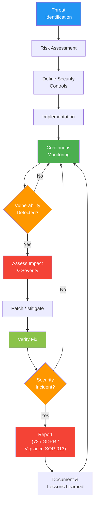

# Cybersecurity Management Procedure

## 1. Purpose

This procedure defines how Therapeak B.V. manages cybersecurity throughout the lifecycle of the Therapeak medical device software, including threat assessment, security controls, vulnerability management, and incident response. This ensures compliance with EU MDR Annex I Section 17.2 and is based on MDCG 2019-16 guidance on cybersecurity for medical devices.

**Related documents:** [[SOP-011]] Software Lifecycle Management, [[SOP-015]] Control of Nonconforming Product, [[SOP-013]] Vigilance and Field Safety Procedure

## 2. Scope

This procedure applies to:
- The Therapeak production infrastructure and application
- AI model pipeline security (Anthropic Claude, accessed via OpenRouter gateway)
- Data protection for health data processed by Therapeak
- Third-party service security assessment
- Vulnerability management and security incident response

## 3. Responsibilities

| Role | Person | Responsibility |
|------|--------|---------------|
| Security Officer / System Administrator | Sarp Derinsu | Manages all cybersecurity controls, monitors for threats, responds to security incidents |

## 4. Procedure

### Process Flow

### 4.1 Security Architecture Overview

#### 4.1.1 Infrastructure

| Component | Details | Location |
|-----------|---------|----------|
| Application server | Hetzner VPS | Nuremberg, Germany (EU) |
| Database | MariaDB 10 | Same server (Hetzner) |
| Cache/Queue | Redis | Same server (Hetzner) |
| WebSocket | Soketi (self-hosted) | Same server (Hetzner) |
| SSL/TLS | Let's Encrypt (auto-renewed) | -- |
| Email | AWS SES (eu-north-1, Stockholm) | EU |
| File storage | AWS S3 (avatar images only) | EU |
| AI processing | Anthropic Claude, accessed via OpenRouter gateway (routes through Vertex AI, Bedrock, Anthropic API) | Various (data transit) |

#### 4.1.2 Access Control

| System | Access | 2FA Status |
|--------|--------|------------|
| Production server (SSH) | Sarp Derinsu only | SSH key authentication |
| GitHub repository | Sarp Derinsu only | 2FA enabled |
| Hetzner cloud console | Sarp Derinsu only | 2FA enabled |
| Stripe dashboard | Sarp Derinsu only | 2FA enabled |
| AWS console | Sarp Derinsu only | 2FA enabled |
| OpenRouter dashboard | Sarp Derinsu only | 2FA not available |
| Therapeak admin panel | Sarp Derinsu (Nisan Derinsu has access but does not use it) | 2FA not implemented |

**Compensating controls for systems without 2FA:**
- OpenRouter: API key rotation on suspicion of compromise; IP-restricted API access where supported; monitoring for anomalous API usage
- Admin panel: accessible only via authenticated session on the main application; server-level access controls (SSH); planned implementation of admin 2FA before CE marking

#### 4.1.3 Secrets Management

All API keys, database credentials, and sensitive configuration values are stored in `.env` files on the production server. These files are:
- Not committed to git (listed in `.gitignore`)
- Readable only by the application user on the server
- Backed up as part of server backups

**Planned improvement:** Evaluate migration to a dedicated secrets manager or encrypted vault before CE marking.

### 4.2 Data Protection

#### 4.2.1 Data Classification

| Data Category | Examples | Sensitivity |
|---------------|----------|-------------|
| Health data (Art. 9 GDPR) | Chat transcripts, session summaries, clinical reports, mood ratings, survey responses | Highest |
| Personal data | Name, email, date of birth, gender, IP address | High |
| Payment data | Handled entirely by Stripe (not stored by Therapeak) | High (managed by Stripe) |
| Operational data | Logs, metrics, queue data | Medium |

#### 4.2.2 Data at Rest

- **MariaDB database**: stores all health data. Data is NOT encrypted at rest at the database level.
- **Compensating controls for lack of database encryption at rest:**
  - Server access restricted to Sarp via SSH key authentication only
  - Hetzner VPS with 2FA-protected console access
  - No other users have OS-level or database-level access
  - Server located in Hetzner's Nuremberg data center with physical security controls
  - DPA signed with Hetzner covering health data (Art. 9 GDPR)
  - Database accessible only from localhost (not exposed to network)
- **Planned improvement:** Evaluate MariaDB Transparent Data Encryption (TDE) for database-level encryption at rest

#### 4.2.3 Data in Transit

- All user-facing traffic encrypted via TLS (Let's Encrypt SSL certificates, auto-renewed)
- API calls to OpenRouter use HTTPS
- Internal webhook callbacks use HMAC-SHA256 signed headers for integrity verification
- Email delivery via AWS SES uses TLS (note: session summary emails contain therapy content in the email body)

#### 4.2.4 Data Processing Agreements

| Processor | DPA Status | Data Processed |
|-----------|------------|---------------|
| Hetzner | Signed (March 25, 2026) | All personal and health data |
| OpenRouter (API gateway) | Data sharing turned OFF (March 25, 2026); review DPA/terms | Conversation data in transit to Anthropic for AI processing |
| AWS (SES, S3) | AWS DPA accepted | Email addresses, email content, avatar images |
| Stripe | Stripe DPA accepted | Payment and subscription data |

#### 4.2.5 Data Retention and Deletion

| Scenario | Retention Period | Method |
|----------|-----------------|--------|
| Active user account | Data retained while active | -- |
| User self-deletes account | Soft delete immediately; permanent data wipe after 180 days | Automated scheduled command (`app:purge-deleted-users`) |
| Explicit GDPR erasure request | Permanent data wipe within 30 days | Manual trigger of same wipe process |
| QMS and regulatory records | Lifetime of device + 10 years | Git-based retention |

### 4.3 AI Pipeline Security

#### 4.3.1 API Communication

- All AI API calls route through OpenRouter via HTTPS
- OpenRouter API key stored in `.env` file
- Internal webhook responses are verified using HMAC-SHA256 signed headers to prevent tampering

#### 4.3.2 Prompt Injection Mitigation

Prompt injection is a risk specific to AI-powered medical devices. Therapeak mitigates this through:

1. **System prompt reinforcement**: therapeutic safety instructions are embedded in the system prompt with strong role enforcement ("You are the THERAPIST" repeated throughout)
2. **Separation of concerns**: user messages are clearly delineated from system instructions in the API call structure
3. **Output monitoring**: ChatDebugFlag system monitors for role confusion (FLAG_SWITCHED_ROLES), which may indicate successful prompt injection
4. **Manual session review**: Sarp reviews sessions regularly for anomalous AI behavior
5. **Content restrictions**: explicit instructions prevent the AI from revealing system prompts, discussing its own architecture, or executing arbitrary instructions

#### 4.3.3 AI Model Change Security

When switching AI models or versions (e.g., Claude Sonnet 4.5 to a newer version):
- Verify the new model maintains therapeutic safety behavior
- Test with representative conversation scenarios before production deployment
- Monitor closely after deployment for anomalous behavior
- Refer to [[SOP-017]] Change Management for the predetermined change control plan

### 4.4 Anti-Abuse Measures

| Measure | Implementation |
|---------|---------------|
| Temporary email blocking | Blocklist of 106,904+ disposable email domains; updated when new temp domains are discovered |
| IP/country blocking | `BlockCountry` middleware blocks traffic from specified countries and VPN providers |
| User banning | Hardcoded in `config/banned.php` by user ID |
| Checkout blocking | `no_checkout_user_ids` list prevents specific users from purchasing |
| Rate limiting | Laravel rate limiting on API endpoints |

### 4.5 Vulnerability Management

#### 4.5.1 Dependency Management

1. Monitor PHP (Composer) and JavaScript (npm) dependencies for known vulnerabilities
2. Review security advisories for key dependencies: Laravel, Vue.js, and related packages
3. Apply security patches promptly:
   - Critical vulnerabilities (actively exploited, affects Therapeak): within 48 hours
   - High vulnerabilities: within 1 week
   - Medium/Low vulnerabilities: within next release cycle
4. Document dependency updates in git commits

#### 4.5.2 Infrastructure Security

1. Keep the server operating system and system packages updated
2. Monitor Hetzner security advisories
3. Review SSH access logs periodically for unauthorized access attempts
4. Maintain firewall rules (only necessary ports open: 80, 443, SSH)

#### 4.5.3 Security Monitoring

- **Laravel Telescope**: monitors all requests, exceptions, and failed jobs in real time
- **Server logs**: SSH access logs, application error logs
- **OpenRouter usage**: monitor for anomalous API usage patterns that could indicate key compromise
- **Sarp monitors Telescope regularly during active working hours**

### 4.6 Security Incident Response

#### 4.6.1 Incident Classification

| Severity | Examples |
|----------|---------|
| Critical | Health data breach, unauthorized access to production database, compromised API keys affecting patient data |
| High | Unauthorized access attempt (unsuccessful but concerning), vulnerability actively being exploited |
| Medium | Suspicious activity detected but no confirmed breach, dependency vulnerability discovered |
| Low | Failed login attempts, blocked IP addresses, minor security configuration issues |

#### 4.6.2 Incident Response Steps

1. **Detect**: identify the security event through monitoring (Telescope, logs, alerts)
2. **Contain**: immediately limit the impact:
   - Revoke compromised credentials/API keys
   - Block attacking IP addresses
   - Take affected services offline if necessary
3. **Investigate**: determine the scope, root cause, and data affected
4. **Remediate**: fix the vulnerability, restore services securely
5. **Report**:
   - If health data was breached: report to the Dutch DPA (Autoriteit Persoonsgegevens) within 72 hours per GDPR
   - If the breach constitutes a serious incident: follow [[SOP-013]] Vigilance reporting
   - Notify affected users without undue delay if their rights/freedoms are at risk
6. **Document**: record the incident, response actions, and lessons learned
7. **Improve**: update security controls to prevent recurrence; escalate to CAPA ([[SOP-003]]) if systemic

### 4.7 Periodic Security Review

Sarp conducts a security review at least annually (or after any significant change per [[SOP-017]]) covering:

1. Review of access controls and 2FA status for all systems
2. Review of API key rotation schedule
3. Assessment of new threats relevant to AI-powered SaMD
4. Dependency vulnerability scan
5. Review of anti-abuse measure effectiveness
6. Update threat model if the architecture has changed
7. Document review findings and any actions taken

## 5. Records

| Record | Retention | Reference |
|--------|-----------|-----------|
| Security incident records | Lifetime of device + 10 years | -- |
| Vulnerability assessments | Lifetime of device + 10 years | -- |
| Periodic security review reports | Lifetime of device + 10 years | -- |
| Data breach notifications | Lifetime of device + 10 years | -- |
| DPA documentation | Lifetime of device + 10 years | -- |

## 6. References

- [[SOP-011]] Software Lifecycle Management Procedure
- [[SOP-013]] Vigilance and Field Safety Procedure
- [[SOP-015]] Control of Nonconforming Product Procedure
- [[SOP-003]] CAPA Procedure
- [[SOP-017]] Change Management Procedure
- ISO 13485:2016 Clause 7.3 — Design and Development
- EU MDR 2017/745 Annex I, Section 17.2 — IT Security
- MDCG 2019-16 — Guidance on Cybersecurity for Medical Devices
- GDPR (Regulation 2016/679) — Articles 32-34 (Security, Breach Notification)
