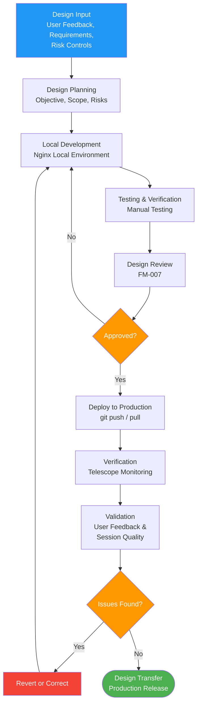

# Design and Development Procedure

## 1. Purpose

This procedure defines the process for planning, executing, reviewing, verifying, and validating design and development activities for Therapeak, an AI-based medical device software. It establishes a lightweight but documented design process appropriate for a one-person software company.

**Related documents:** [[FM-007]] Design Review Form, [[FM-003]] Change Request Form, [[SPE-001]] Software Requirements Specification, [[PLN-005]] Software Development Plan, [[SOP-011]] Software Lifecycle Management, [[SOP-002]] Risk Management Procedure

## 2. Scope

This procedure applies to all design and development activities for Therapeak, including:
- New feature development
- AI model selection and prompt design changes
- Significant modifications to existing functionality
- Safety-related changes
- User interface changes affecting usability

Minor bug fixes and cosmetic changes that do not affect intended purpose, safety, or performance are managed through standard development workflow and do not require full design review.

## 3. Responsibilities

| Role | Responsibility |
|------|---------------|
| Sarp Derinsu (Designer/Developer) | All design and development activities: planning, implementation, testing, deployment, documentation |
| Nisan Derinsu (Clinical Advisor) | Consulted on therapeutic approach, prompt design, and psychological considerations |
| Suzan Slijpen (Regulatory Consultant) | Advises on regulatory impact of design changes, reviews significant changes for MDR compliance |

### 3.1 One-Person Company Context

As a one-person company, Sarp performs all design and development roles. Design review objectivity is maintained through:
- Structured self-review using [[FM-007]] against defined criteria
- Consultation with Nisan (psychology background) on therapeutic aspects
- Consultation with Suzan on regulatory aspects of significant changes
- Documented evidence of verification and validation outcomes

## 4. Procedure

### Process Flow

### 4.1 Design Planning

For each design activity, Sarp shall define:

1. **Objective** — What the change is intended to achieve
2. **Scope** — What parts of the system are affected
3. **Design inputs** — Requirements driving the change (see Section 4.2)
4. **Verification approach** — How to confirm the implementation meets design inputs
5. **Validation approach** — How to confirm the change meets user needs in production
6. **Risk considerations** — Potential safety impacts, referencing [[SOP-002]]
7. **Regulatory impact** — Whether the change is significant per [[SOP-017]]

Design planning is documented in [[FM-007]] for significant changes. For routine changes, planning is captured in the change request ([[FM-003]]) and commit history.

Detailed software development lifecycle activities are defined in [[PLN-005]] Software Development Plan.

### 4.2 Design Inputs

Design inputs are gathered from the following sources:

| Source | Description | Examples |
|--------|-------------|---------|
| User feedback | Contact messages, complaints, observed usage patterns | Accessibility request, feature request |
| Creative ideas | Sarp's ideas for improving therapy effectiveness | New session flow, prompt improvements |
| Clinical considerations | Input from Nisan on therapeutic approach | Prompt wording for sensitive topics, coping strategy suggestions |
| Session quality data | Monitoring via Telescope and session review | Role confusion patterns, unhelpful response patterns |
| Regulatory requirements | MDR, ISO 13485, MDCG guidance, NB feedback | Safety labelling, intended purpose changes |
| Risk management | Identified risks requiring design controls | [[RA-001]] risk control measures |
| Post-market surveillance | PMS data, trend analysis | [[SOP-009]] findings |
| Software requirements | Functional, performance, and safety requirements | [[SPE-001]] |

Design inputs shall be:
- Documented (in [[FM-007]], [[FM-003]], or the requirements specification)
- Reviewed for adequacy and completeness
- Free from contradictions

### 4.3 Design Process

Therapeak follows a lightweight iterative development process appropriate for a continuously deployed SaaS medical device:

#### 4.3.1 Local Development

1. Sarp develops the change in a local Nginx development environment
2. Code changes are committed to Git with descriptive commit messages
3. For AI-related changes: prompt modifications are tested with representative conversation scenarios locally

#### 4.3.2 Testing (Verification)

Local verification before deployment:

| Verification Activity | Method | Evidence |
|----------------------|--------|----------|
| Functional testing | Manual testing of the changed feature in local environment | Test observations documented in [[FM-007]] or commit messages |
| AI output quality | Review AI responses to representative scenarios with modified prompts | Sample conversations saved or screenshots |
| Regression check | Manual testing of related features to confirm no unintended effects | Test observations |
| Code review | Self-review of code changes via Git diff | Git commit history |
| Requirements check | Verify implementation against design inputs and [[SPE-001]] | Documented in [[FM-007]] |

#### 4.3.3 Deployment

1. Changes are deployed to the production server (Hetzner)
2. Deployment process follows the established workflow
3. For significant changes, deployment timing is chosen to allow monitoring (avoid late-night or weekend deployments)

#### 4.3.4 Production Monitoring (Validation)

Post-deployment validation confirms the change meets user needs in the real environment:

| Validation Activity | Method | Timeframe |
|--------------------|--------|-----------|
| System monitoring | Laravel Telescope: error tracking, query performance, queue health | First 24-48 hours |
| AI output monitoring | Manual review of live therapy sessions for quality and safety | Ongoing (1-2 sessions per day/week) |
| User feedback monitoring | Contact messages, complaints related to the change | Ongoing |
| Session quality checks | Automated monitoring jobs (role confusion, non-response detection) | Continuous |
| Performance metrics | Response times, error rates, session completion rates | Ongoing |

If validation reveals issues, the change is reverted or corrected immediately.

### 4.4 AI-Specific Design Controls

Given the AI nature of the device, additional design controls apply:

#### 4.4.1 Model Selection

When selecting or changing AI models:

1. Evaluate model capabilities against therapeutic requirements
2. Test with representative therapy scenarios (diverse topics, languages, edge cases)
3. Compare output quality against the current model
4. Assess safety characteristics (crisis handling, harmful content avoidance)
5. Document the selection rationale in [[FM-007]]
6. Consider fallback models in case of provider outages

Current model configuration is documented in [[PLN-005]].

#### 4.4.2 Prompt Design

Prompt changes are a critical design activity because they directly affect device output:

1. Document the intended change and rationale
2. Consult Nisan on therapeutic appropriateness where relevant
3. Test with diverse conversation scenarios locally
4. Review for safety instruction integrity (crisis handling, role enforcement, relationship protection)
5. Deploy and monitor output quality closely
6. Maintain version history of prompt files in Git

#### 4.4.3 Output Quality Verification

For any change that may affect AI output:

1. Verify outputs remain within the intended purpose (supportive guidance, not diagnosis or treatment)
2. Check that safety messaging and escalation pathways remain intact
3. Confirm that output format requirements are maintained (conversational tone, no lists, appropriate length)
4. Monitor for unintended behavioral changes in production

### 4.5 Design Review

Design reviews ensure that design outputs meet design inputs and identify problems. Reviews are conducted at appropriate stages using [[FM-007]]:

| Review Stage | When | Participants | Focus |
|-------------|------|--------------|-------|
| Concept review | Before significant development begins | Sarp, Suzan (if regulatory impact) | Feasibility, regulatory impact, risk |
| Implementation review | Before deployment of significant changes | Sarp, Nisan (if therapeutic aspects) | Verification results, requirements coverage |
| Post-deployment review | After monitoring period for significant changes | Sarp | Validation results, user impact, issues |

For each review, [[FM-007]] captures:
- Design inputs reviewed
- Verification/validation results
- Open issues or concerns
- Decision (proceed, rework, or abandon)
- Action items with responsible persons and dates

### 4.6 Design Transfer

Design transfer for Therapeak means deploying verified code to the production environment:

1. All verification activities completed satisfactorily
2. Design review completed and documented
3. Risk assessment updated if needed
4. Code deployed to production server
5. Validation monitoring initiated

### 4.7 Design Changes

Design changes are managed per [[SOP-017]] Change Management Procedure. For each change:

1. Document the proposed change using [[FM-003]]
2. Assess the change against the original design inputs
3. Classify as significant or non-significant per [[SOP-017]]
4. Evaluate impact on safety, performance, and regulatory compliance
5. Perform verification and validation appropriate to the scope of the change
6. Update affected documents ([[SPE-001]], risk management file, etc.)
7. Conduct design review before deployment if significant

### 4.8 Design Output Documentation

Design outputs include:
- Source code (Git repository with version history)
- Prompt instruction files (versioned in Git)
- Updated [[SPE-001]] Software Requirements Specification
- Updated risk management file where applicable
- Test evidence and review records
- Deployment records

Design outputs shall be traceable to design inputs.

## 5. Records

| Record | Retention | Reference |
|--------|-----------|-----------|
| Design Review Form | Lifetime of device + 2 years | [[FM-007]] |
| Change Request Form | Lifetime of device + 2 years | [[FM-003]] |
| Test evidence (screenshots, logs) | Lifetime of device + 2 years | — |
| Git commit history | Lifetime of device + 2 years | Repository |
| Prompt version history | Lifetime of device + 2 years | Repository |

## 6. References

- [[QM-001]] Quality Manual
- [[SOP-001]] Document Control Procedure
- [[SOP-002]] Risk Management Procedure
- [[SOP-011]] Software Lifecycle Management Procedure
- [[SOP-017]] Change Management Procedure
- [[FM-007]] Design Review Form
- [[FM-003]] Change Request Form
- [[SPE-001]] Software Requirements Specification
- [[PLN-005]] Software Development Plan
- [[RA-001]] Risk Management File
- [ISO 13485:2016 Clause 7.3](/references/iso-13485#clause-7-3)
- [EU MDR 2017/745 Article 10(3)](/references/eu-mdr#article-10-general-obligations-of-manufacturers)
- [EU MDR 2017/745 Annex II](/references/eu-mdr#annex-ii-technical-documentation)
