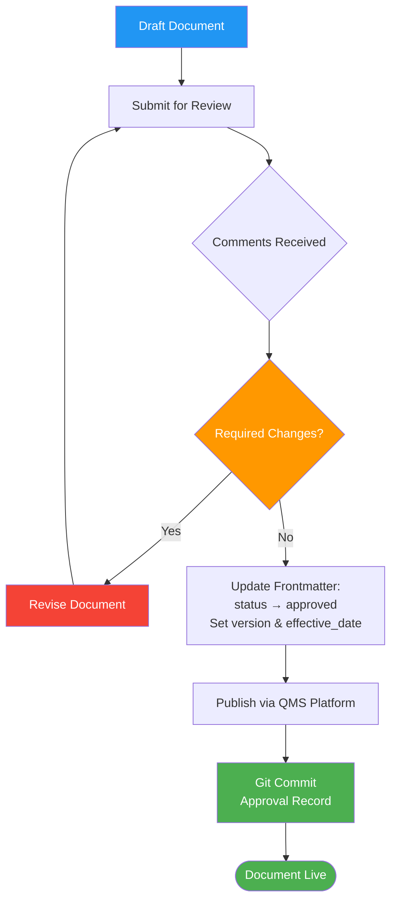

# Document Control Procedure

## 1. Purpose

This procedure defines how QMS documents are created, reviewed, approved, revised, and obsoleted within the Therapeak QMS platform. The platform uses git-based version control with a publish workflow, ensuring full traceability and compliance with [Clause 4.2.4](/references/iso-13485#clause-4-2-4) and [Clause 4.2.5](/references/iso-13485#clause-4-2-5).

**Related documents:** [[QM-001]] Quality Manual, [[POL-001]] Quality Policy

## 2. Scope

This procedure applies to all controlled QMS documents, including:
- Quality Manual (QM)
- Policies (POL)
- Standard Operating Procedures (SOP)
- Plans (PLN)
- Forms (FM)
- Diagrams (DWG)
- Risk management files and technical documentation

This procedure does NOT apply to reference documents (e.g., copies of ISO standards, EU MDR text, MDCG guidance) stored in the `/references` directory, which are uncontrolled reference copies.

## 3. Responsibilities

| Role | Person | Responsibility |
|------|--------|---------------|
| Document Author | Sarp Derinsu | Creates and revises all QMS documents |
| Reviewer | Suzan Slijpen (Pander Consultancy) or Scarlet (Notified Body) | Reviews documents via comments; flags required changes |
| Approver | Sarp Derinsu | Approves and publishes documents |

Suzan Slijpen advises on regulatory content and reviews documents but does not create or approve QMS documents. Scarlet (Notified Body) may access and comment on documents as part of ongoing oversight.

## 4. Procedure

### Process Flow

### 4.1 Document Identification and Numbering

All QMS documents are assigned a unique identifier using the following scheme:

| Prefix | Document Type | Example |
|--------|--------------|---------|
| QM-NNN | Quality Manual | QM-001 |
| POL-NNN | Policy | POL-001 |
| SOP-NNN | Standard Operating Procedure | SOP-001 |
| PLN-NNN | Plan | PLN-001 |
| FM-NNN | Form | FM-001 |
| DWG-NNN | Diagram | DWG-001 |
| RA-NNN | Risk Assessment / Risk File | RA-001 |
| REC-NNN | Record (completed form instance) | FM-001-REC-001 |

Each document includes YAML frontmatter with: `id`, `title`, `type`, `version`, `status`, `effective_date`, `author`, `iso_refs`, and `mdr_refs`.

### 4.2 Document Creation

1. Author creates the document as a markdown file in the appropriate directory within the QMS platform
2. The document is saved in **draft** status (`status: "draft"`)
3. Git automatically tracks the creation and all subsequent changes
4. Cross-references to other documents use `[[DOC-ID]]` syntax (e.g., `[[SOP-002]]`)

### 4.3 Document Review

1. Author notifies the reviewer (Suzan Slijpen) that a document is ready for review
2. Reviewer reads the document on the QMS platform and submits comments
3. Comments are categorized as:
   - **Required changes** — must be resolved before approval (these block the publish workflow)
   - **Suggestions** — optional improvements, do not block approval
4. Author addresses all required changes and updates the document
5. Once all required-change comments are resolved, the document is eligible for approval

For routine or low-risk document updates, Sarp may self-review and approve without external review, documenting the rationale.

### 4.4 Document Approval and Publishing

1. Author verifies all required-change comments are resolved
2. Author updates the frontmatter: `status: "approved"`, sets `version` and `effective_date`
3. Author publishes the document using the QMS platform publish workflow
4. The publish action creates a git commit, serving as the permanent approval record
5. The published document becomes the current controlled version

### 4.5 Document Revision

When a document requires changes:

1. Author edits the existing document (the platform tracks all changes via git)
2. The document status changes to **draft** during revision
3. The review and approval process (4.3 and 4.4) is repeated
4. The version number is incremented (e.g., 1.0 to 2.0 for major changes, 1.0 to 1.1 for minor corrections)
5. The previous version remains accessible in the git history

**Version numbering:**
- Major version (X.0): Significant content changes, new sections, process changes
- Minor version (X.Y): Typo corrections, formatting, clarifications that do not change process requirements

### 4.6 Document Obsolescence

When a document is no longer needed:

1. Author changes the status to **obsolete** in the frontmatter
2. The document remains in the repository (git history preserves all versions)
3. Obsolete documents are clearly marked and no longer appear as active in the QMS

### 4.7 External Documents

External documents (e.g., supplier certificates, NB correspondence, clinical literature) that are part of the QMS are uploaded to the platform with a sidecar metadata file (`.meta.json`) containing document identification and context.

### 4.8 Document Retention

All QMS documents and their complete revision history are retained for the lifetime of the device plus 10 years, in accordance with [Article 10(8)](/references/eu-mdr#article-10-general-obligations-of-manufacturers) of the EU MDR. Git history provides an immutable record of all changes.

## 5. Records

| Record | Retention | Reference |
|--------|-----------|-----------|
| Git commit history (all document versions) | Lifetime of device + 10 years | — |
| Review comments | Lifetime of device + 10 years | — |
| Published document snapshots | Lifetime of device + 10 years | — |

## 6. References

- [[QM-001]] Quality Manual
- [[POL-001]] Quality Policy
- [ISO 13485:2016 Clause 4.2.4](/references/iso-13485#clause-4-2-4) — Document Control
- [ISO 13485:2016 Clause 4.2.5](/references/iso-13485#clause-4-2-5) — Control of Records
- [EU MDR 2017/745 Article 10(9)](/references/eu-mdr#article-10-general-obligations-of-manufacturers)
