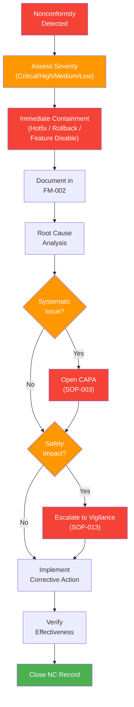

# Control of Nonconforming Product Procedure

## 1. Purpose

This procedure defines how Therapeak B.V. identifies, documents, evaluates, segregates, and disposes of nonconforming product (software) to prevent unintended use and ensure patient safety. This applies to the Therapeak AI therapy medical device software in compliance with ISO 13485:2016 Clause 8.3 and EU MDR Article 10(9).

**Related documents:** [[FM-002]] Deviation/Nonconformance Form, [[SOP-003]] CAPA Procedure, [[SOP-013]] Vigilance and Field Safety Procedure

## 2. Scope

This procedure applies to:
- All nonconformities identified in the Therapeak medical device software
- Nonconformities in QMS processes that affect product quality or safety
- Nonconforming third-party components (AI models, libraries, infrastructure)

## 3. Responsibilities

| Role | Person | Responsibility |
|------|--------|---------------|
| Quality Manager / Developer | Sarp Derinsu | Detects, evaluates, documents, and disposes of all nonconformities; decides on corrective action |

## 4. Definitions

For the Therapeak AI therapy software, nonconforming product includes:

| Category | Examples |
|----------|---------|
| Safety-affecting bugs | Software defect that causes incorrect crisis handling, wrong user data displayed, session data loss |
| AI generating harmful output | AI consistently providing clinically inappropriate guidance, encouraging harmful behavior, failing to follow therapeutic safety instructions |
| Data integrity issues | Corrupted session data, incorrect user reports, data displayed to wrong user, database inconsistencies |
| Performance failures | Software failing to meet specified performance requirements (e.g., response time, availability targets) |
| Security vulnerabilities | Exploitable vulnerabilities that could compromise health data or device function |
| Regulatory nonconformities | Software not meeting requirements specified in the technical documentation or IFU |

## 5. Procedure

### Process Flow

### 5.1 Detection

Nonconformities may be detected through:

1. **User complaints** processed per [[SOP-004]]
2. **System monitoring** via Laravel Telescope (request errors, failed jobs, exceptions)
3. **Session quality monitoring** via ChatDebugFlag system:
   - FLAG_SWITCHED_ROLES — AI responding as patient instead of therapist
   - FLAG_DID_NOT_RESPOND — AI failing to respond to user messages
4. **Manual session review** during routine post-market surveillance
5. **Testing** during development and before release
6. **Internal audits** per [[SOP-012]]
7. **External audit findings** from Notified Body (Scarlet)
8. **Post-market surveillance** data analysis

### 5.2 Documentation

When a nonconformity is identified:

1. Open a deviation record using [[FM-002]] Deviation/Nonconformance Form
2. Assign a unique nonconformance number (NC-NNN)
3. Document:
   - Date and time of detection
   - Source of detection (complaint, monitoring, testing, audit, etc.)
   - Description of the nonconformity
   - Affected software version and component
   - Number of users potentially affected (if applicable)
   - Initial severity assessment

### 5.3 Severity Classification

| Severity | Criteria | Response Time |
|----------|----------|---------------|
| Critical | Patient safety risk: AI generating harmful guidance, data breach, crisis handling failure | Immediate action (within hours) |
| High | Significant quality impact: data integrity issues, recurring AI quality problems, security vulnerability | Action within 24 hours |
| Medium | Minor quality impact: isolated AI quality issue, non-safety bug affecting user experience | Action within 5 business days |
| Low | Cosmetic or minor: UI glitch, non-critical performance degradation | Action within next release cycle |

### 5.4 Immediate Containment

Before full investigation, Sarp takes immediate action to prevent further harm:

| Action | When Used | Implementation |
|--------|-----------|---------------|
| **Hotfix** | Bug can be quickly patched without side effects | Code fix, test, deploy to production |
| **Rollback** | Current version is unsafe and previous version is safe | `git revert` to previous known-good commit, deploy |
| **Feature disable** | Specific feature is nonconforming but rest of app is safe | Toggle feature flag or comment out feature, deploy |
| **User blocking** | Specific users affected by data integrity issue | Block affected user IDs via `config/banned.php` or database |
| **Service suspension** | Widespread safety issue affecting all users | Take application offline (maintenance mode: `php artisan down`) |

The containment action is documented in the [[FM-002]] record.

### 5.5 Investigation and Root Cause Analysis

1. Gather evidence: logs (Telescope), chat transcripts, database records, git history
2. Identify the root cause of the nonconformity
3. Determine the scope: how many users affected, how long the issue existed, which versions
4. Assess whether the nonconformity constitutes a serious incident requiring vigilance reporting per [[SOP-013]]
5. Document findings in the [[FM-002]] record

### 5.6 Disposition

Based on the investigation, Sarp determines the disposition:

| Disposition | Description |
|-------------|-------------|
| **Use as-is** | Nonconformity is cosmetic or has negligible impact on safety/performance; document justification including risk assessment |
| **Rework (fix)** | Develop and deploy a software fix; verify the fix resolves the nonconformity without introducing new issues |
| **Reject (rollback)** | Revert to previous version; the nonconforming version is removed from production |
| **Concession** | Accept the nonconformity temporarily with compensating controls while a permanent fix is developed; document the risk assessment and compensating controls |

For any disposition decision, the potential impact on product safety and regulatory compliance is evaluated and documented.

### 5.7 Verification of Corrective Action

After implementing the disposition:

1. Verify the fix resolves the nonconformity (testing in staging environment, then production verification)
2. Confirm no regression or new issues were introduced
3. For safety-related fixes, perform targeted verification of affected safety functions
4. Document verification results in the [[FM-002]] record

### 5.8 Escalation to CAPA

A nonconformity is escalated to the CAPA process ([[SOP-003]]) when:

- The same or similar nonconformity recurs (pattern of failures)
- Root cause analysis reveals a systematic process weakness
- The nonconformity is rated Critical or High severity
- An audit finding requires formal corrective action
- The nonconformity resulted in a serious incident

CAPA addresses the systemic root cause; the nonconformance record addresses the specific instance.

### 5.9 Escalation to Vigilance

If during investigation a nonconformity is determined to have caused or could have caused a serious incident (death, serious deterioration in health, serious public health threat), immediately escalate to [[SOP-013]] Vigilance and Field Safety Procedure.

### 5.10 Notification to Notified Body

For nonconformities that affect the basis of CE certification (e.g., fundamental safety issues, changes to intended purpose), Sarp notifies Scarlet (Notified Body) as part of the ongoing surveillance obligations.

## 6. Records

| Record | Retention | Reference |
|--------|-----------|-----------|
| Deviation/Nonconformance Form | Lifetime of device + 10 years | [[FM-002]] |
| Investigation and root cause analysis | With nonconformance record | -- |
| Disposition and verification evidence | With nonconformance record | -- |
| Corrective action records (if escalated) | Lifetime of device + 10 years | [[FM-001]] |

## 7. References

- [[FM-002]] Deviation/Nonconformance Form
- [[SOP-003]] CAPA Procedure
- [[SOP-004]] Complaint Handling Procedure
- [[SOP-013]] Vigilance and Field Safety Procedure
- [[SOP-012]] Internal Audit Procedure
- ISO 13485:2016 Clause 8.3 — Control of Nonconforming Product
- EU MDR 2017/745 Article 10(9)
