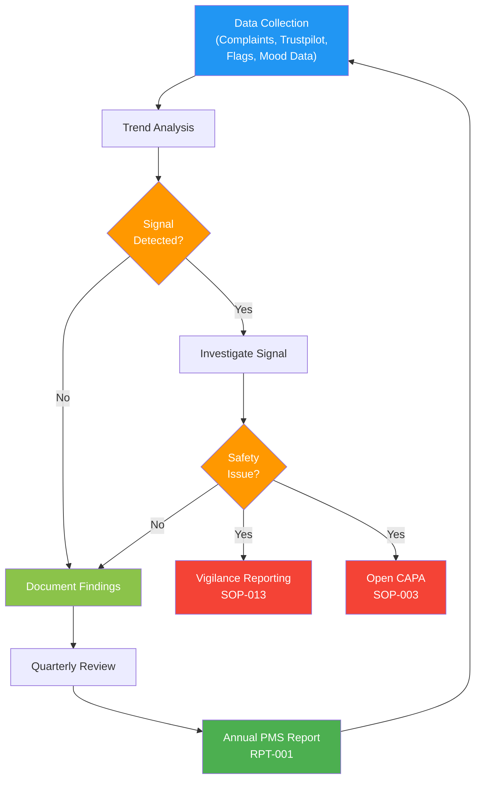

# Post-Market Surveillance Procedure

## 1. Purpose

This procedure defines how Therapeak B.V. systematically gathers, records, and analyzes post-market data about the Therapeak medical device throughout its lifetime. The goal is to identify any need for corrective or preventive actions, to update the benefit-risk assessment, and to detect trends or signals that may indicate safety or performance concerns.

**Related documents:** [[PLN-004]] PMS Plan, [[RPT-001]] PMS Report, [[PLN-003]] PMCF Plan, [[SOP-013]] Vigilance Procedure

## 2. Scope

This procedure applies to all post-market surveillance activities for the Therapeak AI therapy medical device software (Class IIa, Rule 11). It covers:
- Collection of data from all defined PMS sources
- Trend analysis and signal detection
- Periodic reporting (PMS Report, updated at least annually)
- Escalation to vigilance reporting when serious incidents are identified
- Input to the clinical evaluation process and risk management

This procedure becomes active once the device enters the market with CE marking. Pre-market experience from the wellness version provides baseline data for comparison.

## 3. Responsibilities

| Role | Person | Responsibility |
|------|--------|---------------|
| PMS Owner | Sarp Derinsu | Collects and analyzes all PMS data, writes PMS Report, escalates signals |
| Regulatory Consultant | Suzan Slijpen | Advises on PMS methodology, reviews PMS Report |
| Emergency Backup | Nisan Derinsu | Monitors contact email when Sarp is unavailable; escalates potential serious incidents per [[SOP-013]] |

## 4. Procedure

### Process Flow

### 4.1 PMS Data Sources

The following data sources are monitored on an ongoing basis:

| Source | Data Collected | Frequency | Method |
|--------|---------------|-----------|--------|
| User complaints | Reports of harm, dissatisfaction, malfunction | Continuous | info@therapeak.com + in-app contact form |
| Contact messages | General user feedback, feature requests, usability issues | Continuous | info@therapeak.com + in-app contact form |
| Trustpilot reviews | User satisfaction, reported experiences, negative outcomes | Weekly | Manual review of new reviews |
| Telescope monitoring | Application errors, failed requests, AI response failures | Continuous | Laravel Telescope dashboard |
| Session quality flags | FLAG_SWITCHED_ROLES (AI responds as patient), FLAG_DID_NOT_RESPOND (AI unresponsive) | Continuous (automated) | GPT-4o analysis via ChatDebugFlag jobs |
| Mood tracking data | User self-reported mood trends, AI-assessed mood trends | Monthly review | Database queries on mood ratings |
| User retention metrics | Subscription cancellations, churn rate, session frequency | Monthly review | Stripe dashboard + database queries |
| Literature and regulatory updates | New clinical evidence, MDCG guidance, field safety notices from equivalent devices | Quarterly | Manual search of PubMed, EUDAMED, manufacturer websites |
| EUDAMED | Vigilance reports, field safety corrective actions for similar devices | Quarterly | EUDAMED database search |

### 4.2 Data Collection and Recording

1. All user complaints and contact messages are received via email (info@therapeak.com) or the in-app contact form
2. Complaints that report harm, adverse events, or device malfunction are flagged immediately for evaluation against vigilance reporting criteria per [[SOP-013]]
3. Complaints requiring technical fixes are labelled "Needs-fix" in email for tracking
4. Session quality flags (FLAG_SWITCHED_ROLES, FLAG_DID_NOT_RESPOND) are recorded automatically in the database and reviewed as part of PMS analysis
5. All PMS data is summarized in the PMS Report [[RPT-001]]

### 4.3 Trend Analysis and Signal Detection

Trend analysis is performed at least quarterly and covers:

1. **Complaint trends:** Number and type of complaints per period, compared to previous periods and user base size
2. **Session quality trends:** Frequency of FLAG_SWITCHED_ROLES and FLAG_DID_NOT_RESPOND events as a proportion of total sessions
3. **Mood tracking trends:** Aggregate user mood trajectories over time (are users generally improving, stable, or declining?)
4. **Retention trends:** Changes in churn rate, average session frequency, and subscription duration
5. **Error trends:** Application error rates from Telescope monitoring

A signal is any data point or trend that suggests:
- A previously unidentified hazard
- An increase in frequency or severity of a known risk
- A systematic quality or performance issue
- A deviation from expected clinical performance

### 4.4 Signal Evaluation

When a signal is detected:

1. Assess whether it constitutes a serious incident requiring vigilance reporting per [[SOP-013]]
2. Evaluate whether it requires a CAPA per [[SOP-003]]
3. Determine whether the benefit-risk assessment needs updating
4. Assess whether the clinical evaluation needs updating per [[SOP-012]]
5. Document the evaluation and any actions taken in the PMS Report [[RPT-001]]

### 4.5 PMS Report

As a Class IIa device, Therapeak requires a **PMS Report** (not a Periodic Safety Update Report). The PMS Report is prepared in accordance with Article 85 and must:

1. Be updated **at least annually**
2. Summarize all PMS data collected during the reporting period
3. Include trend analysis results and conclusions
4. Document any corrective or preventive actions taken
5. Provide input to the clinical evaluation and risk management processes
6. Be made available to the Notified Body (Scarlet) upon request
7. Be stored within the technical documentation

The PMS Report template is [[RPT-001]].

### 4.6 Input to Other Processes

PMS data feeds into the following processes:

| Receiving Process | Input Provided | Frequency |
|-------------------|---------------|-----------|
| Clinical evaluation [[SOP-012]] | Clinical performance data, user outcome trends | At least annually |
| Risk management [[SOP-006]] | New hazards, updated risk estimates | When signals detected |
| CAPA [[SOP-003]] | Systematic issues requiring corrective/preventive action | As needed |
| PMCF [[PLN-003]] | Gaps in clinical evidence identified through PMS | At least annually |
| Vigilance [[SOP-013]] | Serious incidents, field safety corrective actions | Immediately upon detection |
| Management review [[SOP-005]] | PMS summary, trends, actions taken | At least annually |

### 4.7 Escalation to Vigilance

If any PMS data source reveals a potential serious incident (death, serious deterioration in health, serious public health threat), escalation to the vigilance process [[SOP-013]] is immediate. Timelines for reporting to the competent authority are defined in [[SOP-013]] and must be strictly followed.

### 4.8 Pre-Market Baseline Data

The wellness version of Therapeak (device_mode=wellness) has been operating with a few hundred subscribers prior to CE marking. Key baseline data from this period includes:
- No reported serious adverse events or harm
- Complaint types and frequencies
- Session quality flag rates
- User retention patterns

This baseline data is documented in the initial PMS Report and serves as the comparison point for post-market trend analysis.

## 5. Records

| Record | Retention | Reference |
|--------|-----------|-----------|
| PMS Report | Lifetime of device + 10 years | [[RPT-001]] |
| Complaint records | Lifetime of device + 10 years | Email archive |
| Session quality flag data | Lifetime of device + 10 years | Database |
| Trend analysis summaries | Lifetime of device + 10 years | Within PMS Report |

## 6. References

- [[PLN-004]] PMS Plan
- [[RPT-001]] PMS Report
- [[PLN-003]] PMCF Plan
- [[SOP-013]] Vigilance Procedure
- [[SOP-003]] CAPA Procedure
- [[SOP-006]] Risk Management Procedure
- [[SOP-012]] Clinical Evaluation Procedure
- [[SOP-005]] Management Review Procedure
- ISO 13485:2016 Clause 8.2.1
- EU MDR 2017/745 Articles 83, 84, 85, 86
- EU MDR 2017/745 Annex III — Technical Documentation on Post-Market Surveillance
