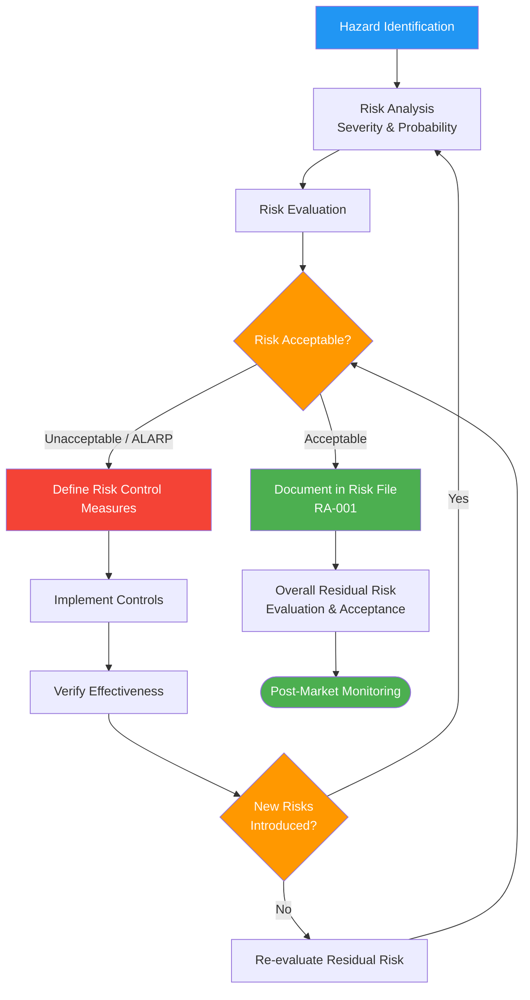

# Risk Management Procedure

## 1. Purpose

This procedure defines the risk management process for Therapeak, an AI-powered Software as a Medical Device (SaMD) classified as Class IIa under EU MDR Rule 11. It establishes how risks are identified, analyzed, evaluated, controlled, and monitored throughout the product lifecycle, in accordance with ISO 14971 principles and [Annex I](/references/eu-mdr#annex-i-general-safety-and-performance-requirements) General Safety and Performance Requirements.

**Related documents:** [[PLN-001]] Risk Management Plan, [[RA-001]] Risk Management File

## 2. Scope

This procedure applies to all risks associated with the Therapeak medical device, including:
- Hazards from normal use and reasonably foreseeable misuse
- AI/ML-specific risks (model performance, training data, output quality)
- Software risks (availability, data integrity, cybersecurity)
- Clinical risks (inappropriate therapeutic guidance, crisis situations)
- Risks from the use environment (home use, unsupervised)

Risk management begins at product concept and continues through post-market surveillance.

## 3. Responsibilities

| Role | Person | Responsibility |
|------|--------|---------------|
| Risk Manager | Sarp Derinsu | Conducts risk analysis, defines controls, maintains risk file, accepts residual risk |
| Regulatory Advisor | Suzan Slijpen (Pander Consultancy) | Reviews risk assessments, advises on regulatory acceptability of risk controls |

## 4. Procedure

### Process Flow

### 4.1 Risk Management Planning

The risk management process is planned and documented in [[PLN-001]] Risk Management Plan, which defines:
- Risk acceptability criteria (severity/probability matrix)
- Verification activities for risk control measures
- Methods for collecting and reviewing post-market information
- Criteria for overall residual risk acceptability

The risk acceptability matrix and risk scoring methodology are defined in [[PLN-001]].

### 4.2 Risk Identification

Risks are identified through the following methods:

1. **Intended use analysis** — Review of intended purpose, target users, use environment, and contraindications
2. **Hazard identification** — Systematic review using ISO 14971 Annex C categories adapted for AI SaMD
3. **AI-specific hazard analysis** — Identification of hazards specific to AI/ML systems (see 4.2.1)
4. **Post-market data** — Complaints, incidents, literature, PMS data ([[SOP-010]])
5. **Design review** — Hazards identified during design and development ([[SOP-006]])

All identified hazards are documented in the [[RA-001]] Risk Management File.

#### 4.2.1 AI SaMD-Specific Hazards

The following AI-specific hazard categories must be considered during risk identification:

| Hazard Category | Examples |
|----------------|----------|
| Model drift | Performance degradation over time due to changes in AI provider models, user population shifts, or prompt effectiveness changes |
| Training data bias | AI model biases affecting therapeutic guidance for specific demographics, cultures, or conditions |
| Inappropriate output | Harmful therapeutic advice, reinforcement of negative thought patterns, failure to recognize crisis situations |
| Hallucination | Fabricated information presented as factual (e.g., invented coping techniques, false clinical claims) |
| Role confusion | AI responding as patient instead of therapist, breaking therapeutic frame |
| Prompt injection | Users manipulating the AI through adversarial inputs to bypass safety instructions |
| Provider dependency | AI provider API outages, model deprecation, or policy changes affecting availability |
| Output variability | Inconsistent therapeutic quality across sessions, languages, or AI model versions |

### 4.3 Risk Analysis

For each identified hazard:

1. Identify the sequence of events leading from hazard to hazardous situation to harm
2. Estimate the **severity** of the potential harm
3. Estimate the **probability of occurrence** of the harm
4. Document the analysis in [[RA-001]]

Severity and probability scales are defined in [[PLN-001]]. For Therapeak as a home-use mental health SaMD:
- Most harms are psychological (transient distress, unhelpful guidance, delayed appropriate care)
- Physical harm is indirect (e.g., if inappropriate advice leads to self-harm — mitigated by crisis delegation to Claude's built-in safety and safety messaging)

### 4.4 Risk Evaluation

Each risk is evaluated against the acceptability criteria defined in [[PLN-001]]:

| Risk Level | Action Required |
|-----------|----------------|
| Acceptable | No further action required; document rationale |
| As Low As Reasonably Practicable (ALARP) | Implement risk controls if practicable; document benefit-risk analysis |
| Unacceptable | Risk controls must be implemented to reduce risk; if risk remains unacceptable, the associated feature/function must not be released |

### 4.5 Risk Control

Risk control measures are selected in the following order of priority (per [ISO 14971 Clause 7.1](/references/iso-14971#71-risk-control-option-analysis)):

1. **Inherent safety by design** — Eliminate the hazard (e.g., do not include diagnostic claims, block minors from access)
2. **Protective measures in the device** — Reduce risk through software controls (e.g., role enforcement in prompts, session quality monitoring, output token limits, fallback models)
3. **Information for safety** — Warnings, disclaimers, instructions for use (e.g., crisis helpline messaging, "this is not a medical document" disclaimers)

For each risk control measure:
1. Document the control measure in [[RA-001]]
2. Implement the control
3. Verify the control is effective (4.6)
4. Assess whether the control introduces new risks
5. Evaluate the residual risk after control implementation

### 4.6 Risk Control Verification

Each risk control measure is verified to confirm:
- The measure has been correctly implemented
- The measure is effective at reducing the identified risk
- No new unacceptable risks have been introduced

Verification methods include: code review, testing, prompt evaluation, session monitoring, and post-market data analysis. Results are documented in [[RA-001]].

### 4.7 Overall Residual Risk Evaluation

After all individual risk controls are implemented and verified:

1. Evaluate whether the overall residual risk is acceptable, considering the totality of risks and the clinical benefit of the device
2. If overall residual risk is not acceptable, collect and review available data on clinical benefits to determine if they outweigh the residual risk
3. Document the overall residual risk evaluation and acceptance decision in [[RA-001]]
4. Sarp Derinsu reviews and formally accepts the overall residual risk

### 4.8 Post-Market Risk Monitoring

Risk management is a continuous activity. Post-market information that may affect the risk analysis is collected through:

- Complaint handling ([[SOP-004]])
- Post-market surveillance ([[SOP-010]])
- Post-market clinical follow-up ([[SOP-011]])
- Vigilance reporting ([[SOP-013]])
- AI model monitoring (session quality checks, role confusion detection)

When new risk information is identified:
1. Review the existing risk analysis for relevance
2. Update [[RA-001]] if new hazards, changed probabilities, or changed severities are identified
3. Implement additional risk controls if needed
4. Initiate CAPA ([[SOP-003]]) if the risk information reveals a systematic issue

Sarp reviews the risk management file at least annually as part of management review, or whenever significant new risk information is received.

## 5. Records

| Record | Retention | Reference |
|--------|-----------|-----------|
| Risk Management Plan | Lifetime of device + 10 years | [[PLN-001]] |
| Risk Management File | Lifetime of device + 10 years | [[RA-001]] |
| Risk control verification records | With risk management file | [[RA-001]] |

## 6. References

- [[PLN-001]] Risk Management Plan
- [[RA-001]] Risk Management File
- [[SOP-001]] Document Control Procedure
- [[SOP-003]] CAPA Procedure
- [[SOP-004]] Complaint Handling Procedure
- [[SOP-010]] Post-Market Surveillance Procedure
- [ISO 13485:2016 Clause 7.1](/references/iso-13485#clause-7-1) — Planning of Product Realization
- [ISO 13485:2016 Clause 7.3.3](/references/iso-13485#clause-7-3-3) — Design and Development Inputs
- [ISO 14971:2019](/references/iso-14971) — Application of Risk Management to Medical Devices
- [EU MDR 2017/745 Article 10(2)](/references/eu-mdr#article-10-general-obligations-of-manufacturers)
- [EU MDR 2017/745 Annex I](/references/eu-mdr#annex-i-general-safety-and-performance-requirements) — General Safety and Performance Requirements
- [MDCG 2019-11](/references/mdcg-2019-11) — Guidance on Qualification and Classification of Software
