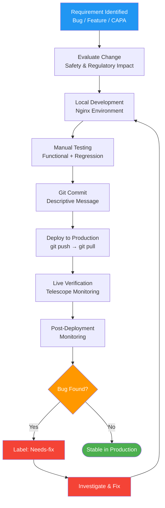

# Software Lifecycle Management Procedure

## 1. Purpose

This procedure defines the software lifecycle management process for the Therapeak medical device software. It describes how software is developed, tested, deployed, maintained, and monitored, applying IEC 62304 principles in a manner proportionate to a one-developer organization.

**Related documents:** [[PLN-005]] Software Development Plan, [[SOP-017]] Change Management Procedure

## 2. Scope

This procedure applies to:
- The Therapeak medical device software (device_mode=medical) — a monolithic Laravel/Vue web application
- All software changes, including bug fixes, feature additions, AI model changes, and configuration changes
- SOUP/OTS (Software of Unknown Provenance / Off-The-Shelf) components used within the device

This procedure does not apply to infrastructure software (operating system, web server) unless changes to that infrastructure affect device safety or performance.

## 3. Responsibilities

| Role | Person | Responsibility |
|------|--------|---------------|
| Software Developer | Sarp Derinsu | Sole developer — designs, implements, tests, deploys, and maintains all software |
| Quality Manager | Sarp Derinsu | Ensures software changes follow this procedure and are traceable |
| Regulatory Consultant | Suzan Slijpen | Advises on regulatory implications of software changes |

## 4. Procedure

### Process Flow



### 4.1 Software Development Environment

| Environment | Purpose | Details |
|-------------|---------|---------|
| Local development | Development and testing | Nginx on developer workstation |
| Production | Live deployment | Hetzner VPS, Nuremberg, Germany |

**There is no staging environment, no CI/CD pipeline, and no automated test suite.** This is documented honestly. Compensating controls are described in Section 4.4.

### 4.2 Development Workflow

The standard development workflow for any software change:

```
1. Identify change → 2. Local development → 3. Local testing → 4. Git commit
→ 5. Git push to main → 6. Git pull on production → 7. Live verification
```

Detailed steps:

1. **Identify the change:** Source may be a bug report (user complaint via contact, labelled "Needs-fix"), a feature request, a CAPA action, a regulatory requirement, or a proactive improvement
2. **Evaluate the change:** Assess whether the change affects device safety or performance. If yes, evaluate per [[SOP-017]] Change Management before implementation
3. **Local development:** Implement the change in the local development environment
4. **Local testing:** Manually test the change in the local environment. Testing includes:
   - Functional verification (does the change work as intended?)
   - Regression check (does the change break existing functionality in the affected area?)
   - For AI-related changes: prompt testing via `routes/prompt-testing.php`
5. **Git commit:** Commit the change to the main branch with a descriptive commit message. The git commit serves as the change record
6. **Deploy to production:** SSH into the production server, run `git pull` to deploy the change
7. **Live verification:** Verify the change works correctly on the production system. Monitor Telescope for errors immediately after deployment
8. **Post-deployment monitoring:** Monitor Telescope and user feedback for unexpected issues in the hours/days following deployment

### 4.3 Bug Fixing Process

Bug reports typically follow this path:

1. User reports an issue via email (info@therapeak.com) or in-app contact form
2. The complaint is labelled "Needs-fix" in email
3. Sarp investigates the issue (Telescope logs, database, code review)
4. Fix is developed and tested locally
5. Fix is deployed following the standard workflow (Section 4.2, steps 4-8)
6. User is notified that the issue has been resolved (when applicable)
7. If the bug relates to a safety concern, a CAPA is considered per [[SOP-003]]

### 4.4 Compensating Controls

The absence of CI/CD, staging environment, and automated tests is mitigated by the following compensating controls:

| Missing Control | Compensating Measure | Rationale |
|----------------|---------------------|-----------|
| No automated tests | Thorough manual testing in local environment before each deployment | Single developer has complete knowledge of the codebase and can assess impact of changes |
| No staging environment | Local environment replicates the production stack (same PHP version, MariaDB, Redis, Nginx) | Local environment is functionally equivalent to production |
| No CI/CD pipeline | Manual deployment via git pull ensures deliberate control over what is deployed and when | Prevents accidental deployments; developer reviews changes at each step |
| No automated regression tests | Manual regression checks focused on the area of change + post-deployment Telescope monitoring | Telescope provides real-time visibility into errors, allowing rapid rollback |
| No code review | Self-review before commit + post-deployment verification | Single developer; compensated by Telescope monitoring and user feedback |

**Rollback procedure:** If a deployment causes issues, Sarp can immediately revert by running `git revert` or `git checkout` to a previous commit and re-deploying. Telescope monitoring enables rapid detection of problems.

### 4.5 AI Model Management

The Therapeak device relies on external AI models for its core therapeutic function. AI model management includes:

#### 4.5.1 Model Selection

| Current Model | Role | Provider |
|---------------|------|----------|
| Claude Sonnet 4.5 | Primary therapy chat | Anthropic via OpenRouter |
| Claude Sonnet 4.6 | A/B test variant | Anthropic via OpenRouter |
| Claude Opus 4 / Sonnet 4 / Sonnet 3.7 | Fallback models | Anthropic via OpenRouter |
| GPT-4o | Session summaries, user reports, session quality monitoring | OpenAI |
| GPT-3.5-turbo | Content moderation (platform content, not therapy chat) | OpenAI |
| Fal.ai (Flux Pro) | AI therapist avatar generation | Fal.ai |

Model changes (switching primary model, adding fallback models, updating prompt templates) are treated as software changes and follow the standard workflow in Section 4.2.

#### 4.5.2 Prompt Management

- Therapeutic instructions are defined in static text files (`chat_room_instructions.txt`, `priority_chat_instructions.txt`) and in code (160-200+ embedded instructions per conversation job)
- Prompt changes are version-controlled via git
- Prompt testing is performed using `routes/prompt-testing.php` before deployment
- Changes to therapeutic prompts require evaluation of potential safety impact per [[SOP-017]]

#### 4.5.3 AI Quality Monitoring

- **Automated monitoring:** ChatDebugFlag system detects FLAG_SWITCHED_ROLES and FLAG_DID_NOT_RESPOND events
- **Manual monitoring:** Sarp reviews 1-2 sessions per day/week for harmful patterns
- **Model performance:** Monitored through user feedback, complaint trends, and session quality flags
- If model quality degrades (e.g., after a provider-side model update), Sarp can switch to a fallback model or adjust prompts

### 4.6 Queue and Service Management

The Therapeak application relies on background job processing and system services:

| Component | Technology | Purpose |
|-----------|-----------|---------|
| Queue worker | Laravel Horizon + Redis | Processes AI conversation jobs, summaries, reports, moderation |
| WebSocket server | Soketi | Real-time message delivery to users |
| Scheduled tasks | Laravel Scheduler (cron) | Periodic jobs (review requests, data maintenance) |

These services run as systemd services on the production server. Service health is monitored via Telescope and system logs.

### 4.7 Software Versioning

- The medical device software will be assigned version **1.0** at the point of CE marking
- The `settings.device_mode` configuration value (`wellness` or `medical`) distinguishes between the wellness product and the medical device
- **Git commits serve as change records:** each commit message describes what was changed and why
- Version numbers are incremented for significant releases as defined in [[PLN-005]]
- For QMS traceability: the git commit hash associated with any production deployment can be identified through the server's git log

### 4.8 SOUP/OTS Management

The following SOUP/OTS components are used in the device:

| Component | Version | Purpose | Risk Significance |
|-----------|---------|---------|-------------------|
| Laravel | 10.x | PHP web framework (backend) | High — core application framework |
| Vue 3 | 3.x | JavaScript framework (frontend) | Medium — user interface |
| Inertia.js | — | SPA bridge between Laravel and Vue | Medium — page routing |
| Vuetify 3 | 3.x | UI component library | Low — visual components |
| Tailwind CSS + DaisyUI | — | CSS framework | Low — styling |
| Laravel Horizon | — | Queue management dashboard | Medium — job processing visibility |
| Laravel Telescope | — | Debug and monitoring dashboard | Low — monitoring only |
| Redis | — | Cache and queue broker | High — message queue processing |
| MariaDB | 10.x | Database | High — all data storage |
| Soketi | — | WebSocket server | Medium — real-time message delivery |
| OpenRouter SDK | — | API gateway client (routes to Anthropic) | High — core AI functionality |
| Spatie Media Library | — | File/image management (avatars) | Low — avatar storage |
| Laravel Sanctum | — | SPA authentication | Medium — security |
| Laravel Passport | — | Service-to-service auth | Medium — inter-service security |
| Vite | 4.x | Frontend build tool | Low — build only |

SOUP management activities:
1. **Inventory:** The SOUP list above is maintained and updated when components are added or upgraded
2. **Update policy:** SOUP components are updated when security patches are released or when updates are needed for functionality. Updates follow the standard development workflow
3. **Risk assessment:** Each SOUP component's risk significance is assessed based on its role in device safety and performance. High-risk SOUP updates receive additional manual testing attention
4. **Known anomalies:** Known vulnerabilities in SOUP components are tracked through Laravel security advisories, npm audit, and GitHub Dependabot alerts (when available)

### 4.9 Software Safety Classification

Per IEC 62304, the Therapeak software is classified as **Class B** (non-serious injury possible). This classification is based on:
- The device provides informational guidance, not direct therapeutic intervention
- Erroneous output could lead to transient distress or unhelpful coping suggestions (non-serious injury)
- The device does not control any hardware or life-supporting functions
- Mitigations (safety prompts, disclaimers, crisis redirection) reduce residual risk

This classification determines the rigor of software lifecycle activities as described in this procedure.

## 5. Records

| Record | Retention | Reference |
|--------|-----------|-----------|
| Git commit history | Lifetime of device + 10 years | Git repository |
| Deployment records (git pull on production) | Lifetime of device + 10 years | Git log on production server |
| Prompt testing results | Lifetime of device + 10 years | Local records / git history |
| SOUP inventory | Lifetime of device + 10 years | This document + [[PLN-005]] |
| Bug reports and fix records | Lifetime of device + 10 years | Email archive + git history |

## 6. References

- [[PLN-005]] Software Development Plan
- [[SOP-017]] Change Management Procedure
- [[SOP-003]] CAPA Procedure
- [[SOP-001]] Document Control Procedure
- IEC 62304:2006+A1:2015 — Medical Device Software — Software Life Cycle Processes
- ISO 13485:2016 Clauses 7.3, 7.5.6
- EU MDR 2017/745 Article 10(9), Annex I (General Safety and Performance Requirements)
