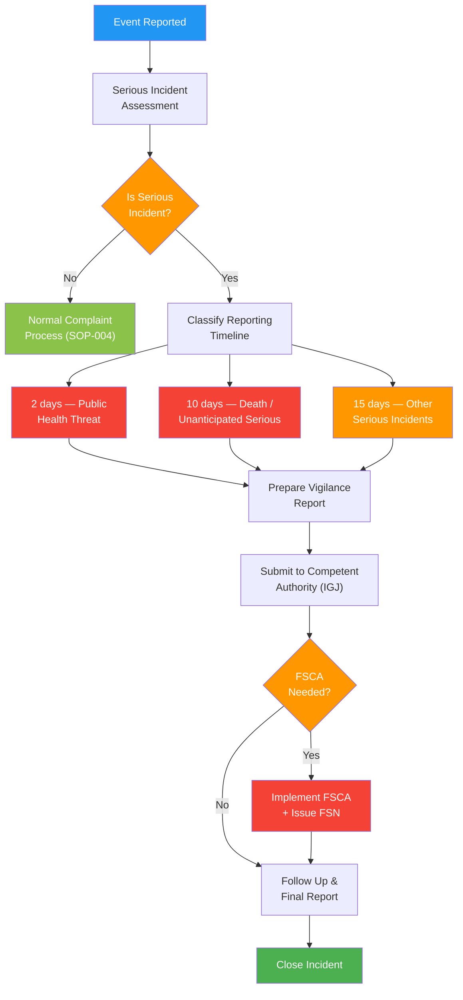

# Vigilance and Field Safety Procedure

## 1. Purpose

This procedure defines how Therapeak B.V. identifies, evaluates, reports, and manages serious incidents and field safety corrective actions (FSCAs) related to the Therapeak medical device, in compliance with EU MDR Articles 87-92 and ISO 13485:2016 Clause 8.2.3.

**Related documents:** [[SOP-004]] Complaint Handling, [[SOP-003]] CAPA Procedure, [[SOP-015]] Control of Nonconforming Product

## 2. Scope

This procedure applies to:
- All serious incidents involving the Therapeak AI therapy software
- Field Safety Corrective Actions (FSCAs)
- Field Safety Notices (FSNs) issued to users
- Trend reporting of non-serious incidents that collectively become significant
- Post-market surveillance data requiring vigilance assessment

## 3. Responsibilities

| Role | Person | Responsibility |
|------|--------|---------------|
| Person Responsible for Regulatory Compliance (PRRC) | Sarp Derinsu | Evaluates incidents, submits reports to competent authority, decides on FSCAs |
| Emergency Backup | Nisan Derinsu | Submits vigilance reports if Sarp is unavailable for more than 24 hours |

Nisan Derinsu (director of Therapeak B.V.) is designated as the emergency backup for vigilance reporting. She has been briefed on what constitutes a reportable serious incident and has access to the vigilance reporting templates and competent authority contact details. This ensures continuity of regulatory reporting obligations when Sarp is unreachable.

## 4. Definitions

| Term | Definition |
|------|-----------|
| Serious Incident | Any incident that directly or indirectly led, might have led, or might lead to: death, serious deterioration in health, or a serious public health threat |
| FSCA | Field Safety Corrective Action — action taken to reduce a risk of death or serious deterioration in health associated with the use of a device that is already on the market |
| FSN | Field Safety Notice — communication sent to users or customers about an FSCA |
| Competent Authority | The national authority responsible for medical devices in the Netherlands (IGJ — Inspectie Gezondheidszorg en Jeugd) |

## 5. Procedure

### Process Flow

### 5.1 Serious Incident Definition for Therapeak

For the Therapeak AI therapy software, serious incidents include but are not limited to:

| Category | Examples |
|----------|---------|
| Validated self-harm or suicidal behavior | User reports self-harm attributed to or following AI guidance; user reports that AI output encouraged harmful behavior |
| Severe psychological distress caused by AI output | AI generates content that causes clinically significant psychological harm (e.g., retraumatization, psychotic episode triggered by AI interaction) |
| Data breach exposing health data | Unauthorized access to therapy transcripts, session summaries, clinical reports, or other health-related personal data |
| Systematic AI safety failure | AI consistently fails to follow safety instructions (e.g., role-switched behavior, providing dangerous therapeutic advice at scale) |
| Failure of crisis safety features | AI fails to handle disclosed suicidal ideation or crisis appropriately, resulting in patient harm |

Not all user complaints constitute serious incidents. The escalation criteria in Section 5.2 determine whether a complaint triggers the vigilance process.

### 5.2 Incident Detection and Escalation

Serious incidents may be detected through:

1. **User complaints** escalated from [[SOP-004]] Complaint Handling
2. **Session monitoring** via Telescope and ChatDebugFlag system (FLAG_SWITCHED_ROLES, FLAG_DID_NOT_RESPOND)
3. **Manual session review** during routine post-market surveillance
4. **External reports** from healthcare professionals, regulators, or media
5. **Data breach detection** through infrastructure monitoring

**Escalation from complaint handling:**

When processing a complaint per [[SOP-004]], Sarp evaluates whether the complaint involves or could involve a serious incident. If any of the following criteria are met, the vigilance procedure is triggered:

- User reports physical harm (including self-harm) related to Therapeak use
- User reports severe psychological distress directly caused by AI output
- User reports that AI provided dangerous or clinically inappropriate guidance
- Evidence of data breach involving health data
- Any complaint suggesting death or serious deterioration in health

### 5.3 Incident Evaluation

Upon identifying a potential serious incident:

1. Document the incident with all available details: date, user ID, description, evidence (chat transcripts, logs, screenshots)
2. Assess whether the event meets the serious incident definition per Article 2(65) of the MDR
3. Assess causality: determine whether the device contributed to the incident
4. Classify the reporting timeline (see Section 5.4)
5. Record the evaluation rationale regardless of whether the incident is deemed reportable

### 5.4 Reporting Timelines

Reports are submitted to the competent authority (IGJ) and via EUDAMED (when available) according to the following timelines:

| Situation | Timeline | Report Type |
|-----------|----------|-------------|
| Serious public health threat | **2 days** from awareness | Initial report |
| Death or unanticipated serious deterioration in health | **10 days** from awareness | Initial report |
| Other serious incidents | **15 days** from awareness | Initial report |
| Follow-up to any initial report | As information becomes available, or as requested by competent authority | Follow-up report |
| Final report | When investigation is complete | Final report |

"Days" refers to calendar days. The clock starts when Sarp becomes aware of the incident or when sufficient information exists to link the event to the device.

### 5.5 Reporting Channels

1. **EUDAMED** (when the vigilance module is available): submit electronic reports via the EU-wide database
2. **Directly to competent authority** (IGJ) if EUDAMED is not yet available or for urgent reports:
   - IGJ website: www.igj.nl
   - Use the MedDev vigilance reporting form or equivalent
3. **Other EU competent authorities**: if the incident occurred in another Member State, the IGJ will coordinate notification. Therapeak cooperates with any requests from other authorities.

### 5.6 Field Safety Corrective Actions (FSCA)

When a serious incident requires corrective action on the device already on the market, Sarp shall:

1. Determine the appropriate FSCA, which may include:
   - **Software update** (hotfix deployed to production)
   - **Rollback** to a previous safe version (git revert)
   - **Feature disable** (disable the affected feature or AI model)
   - **User blocking** (prevent affected users from accessing harmful functionality)
   - **Service suspension** (take the entire service offline if necessary)
2. Implement the FSCA as rapidly as possible, proportionate to the risk
3. Document the FSCA with rationale, implementation details, and verification
4. Report the FSCA to the competent authority alongside or as part of the incident report

### 5.7 Field Safety Notices (FSN)

When users need to be informed about an FSCA:

1. Draft a Field Safety Notice containing:
   - Description of the issue
   - Actions taken by Therapeak
   - Any actions required by users (e.g., disregard specific AI advice, review previous sessions)
   - Contact information for questions
2. Distribute the FSN to affected users via email (using the existing email infrastructure via AWS SES)
3. Publish the FSN on the Therapeak platform if appropriate
4. Submit the FSN to the competent authority
5. Retain the FSN and distribution records

### 5.8 Trend Reporting

Per Article 88, Sarp shall monitor for statistically significant increases in the frequency or severity of non-serious incidents or expected undesirable side effects that could have a significant impact on the benefit-risk analysis.

Trend reporting process:

1. Review complaint data and post-market surveillance findings quarterly (or more frequently if indicated)
2. Identify any upward trends in:
   - Similar non-serious complaints
   - AI safety flags (ChatDebugFlags)
   - User-reported negative experiences
3. If a statistically significant trend is identified, submit a trend report to the competent authority via EUDAMED (or directly)
4. Include: trend description, data analysis, assessment of impact on benefit-risk, and any corrective actions taken

### 5.9 Emergency Backup Procedure

If Sarp Derinsu is unavailable (e.g., medical emergency, travel without connectivity) for more than 24 hours and a serious incident is identified or a reporting deadline is approaching:

1. Nisan Derinsu assesses the situation using the serious incident criteria in Section 5.1
2. For incidents requiring immediate action (2-day or 10-day reports), Nisan submits the initial report to IGJ using the pre-prepared reporting templates stored in the QMS
3. Nisan notifies Sarp as soon as possible
4. If the incident requires an FSCA that involves technical changes, Nisan contacts Suzan Slijpen (regulatory consultant) for guidance while awaiting Sarp's return
5. Sarp completes the follow-up and final reports upon return

Nisan has access to:
- Vigilance reporting templates and IGJ contact details
- The QMS platform (read access)
- The complaint tracking system (email: info@therapeak.com)

## 6. Records

| Record | Retention | Reference |
|--------|-----------|-----------|
| Incident evaluation records | Lifetime of device + 10 years | -- |
| Vigilance reports (initial, follow-up, final) | Lifetime of device + 10 years | -- |
| FSCA documentation | Lifetime of device + 10 years | -- |
| Field Safety Notices | Lifetime of device + 10 years | -- |
| Trend analysis reports | Lifetime of device + 10 years | -- |
| Competent authority correspondence | Lifetime of device + 10 years | -- |

## 7. References

- [[SOP-004]] Complaint Handling Procedure
- [[SOP-003]] CAPA Procedure
- [[SOP-015]] Control of Nonconforming Product Procedure
- ISO 13485:2016 Clause 8.2.3 — Reporting to Regulatory Authorities
- EU MDR 2017/745 Articles 87-92 — Vigilance
- MEDDEV 2.12/1 rev 8 — Guidelines on a Medical Devices Vigilance System
