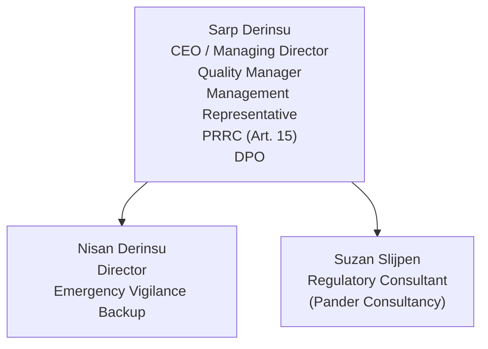
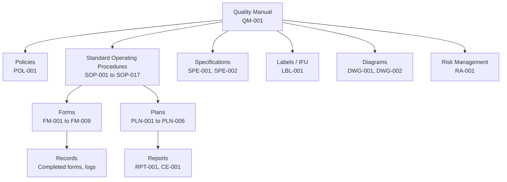

# Quality Manual

## 1. Purpose

This Quality Manual describes the Quality Management System (QMS) of Therapeak B.V. in accordance with ISO 13485:2016 and EU MDR 2017/745. It is the top-level document of the QMS and provides the framework for the design, development, maintenance, and post-market surveillance of our medical device software.

## 2. Scope

### 2.1 QMS Scope

This QMS applies to the design, development, deployment, maintenance, and post-market surveillance of **Therapeak** — an AI-based conversational therapy platform classified as a Class IIa medical device software (SaMD) under EU MDR 2017/745.

The QMS covers all activities from design input through post-market surveillance, performed by Therapeak B.V. and its consultants.

### 2.2 Device Description

Therapeak provides patient-specific supportive conversational guidance intended to help users self-manage mild to moderate mental health symptoms at home. The software uses AI language models to deliver personalized therapy sessions via a web-based chat interface.

- **Classification:** Class IIa under MDR Annex VIII, Rule 11
- **IMDRF category:** Informs clinical management
- **Intended users:** Adults (19+) with mild to moderate mental health conditions
- **Use environment:** Home use, unsupervised
- **MDA code:** MDA 0315
- **EMDN code:** V92

### 2.3 Exclusions

The following ISO 13485:2016 requirements are excluded:

| Clause | Title | Justification |
|--------|-------|---------------|
| 6.4.2 | Contamination control | Not applicable to software |
| 7.5.2 | Cleanliness of product | Not applicable to software |
| 7.5.5 | Particular requirements for sterile medical devices | Software is not sterile |
| 7.5.7 | Particular requirements for validation of processes for sterilization | Not applicable |
| 7.5.9.2 | Particular requirements for implantable medical devices | Software is not implantable |

All excluded clauses relate to physical manufacturing and sterilization processes that do not apply to software-only medical devices.

### 2.4 Regulatory Framework

| Standard / Regulation | Applicability |
|----------------------|---------------|
| [ISO 13485:2016](/references/iso-13485) | QMS requirements for medical devices |
| [EU MDR 2017/745](/references/eu-mdr) | European Medical Device Regulation |
| [ISO 14971:2019](/references/iso-14971) | Risk management for medical devices |
| IEC 62304:2006+A1:2015 | Medical device software lifecycle (principles applied) |
| IEC 62366-1:2015 | Usability engineering (principles applied) |
| [MDCG 2019-11](/references/mdcg-2019-11) | Qualification and classification of software |
| [MDCG 2020-1](/references/mdcg-2020-1) | Clinical evaluation of medical device software |
| [MDCG 2019-16](/references/mdcg-2019-16) | Cybersecurity for medical devices |

## 3. Company Information

### 3.1 Organization

| Field | Detail |
|-------|--------|
| **Legal name** | Therapeak B.V. |
| **KvK** | 96490713 |
| **Address** | Lange Lauwerstraat 207, 3512VH Utrecht, Netherlands |
| **Role under MDR** | Manufacturer |
| **Notified Body** | Scarlet (NB) |
| **Conformity assessment** | Annex IX (QMS + technical documentation) |

### 3.2 Organization Chart

### 3.3 Roles and Responsibilities

| Role | Person | Responsibilities |
|------|--------|-----------------|
| CEO / Managing Director | Sarp Derinsu | Overall business and QMS responsibility, resource allocation |
| Quality Manager / Management Representative | Sarp Derinsu | Maintains QMS, ensures processes are followed, reports to management |
| Person Responsible for Regulatory Compliance (PRRC) | Sarp Derinsu | Ensures regulatory compliance per [MDR Article 15](/references/eu-mdr#article-15-person-responsible-for-regulatory-compliance) |
| Data Protection Officer | Sarp Derinsu | GDPR compliance, data protection |
| Software Developer | Sarp Derinsu | Design, development, deployment, maintenance of the software |
| Director / Emergency Backup | Nisan Derinsu | Emergency vigilance reporting when CEO is unavailable |
| Regulatory Consultant | Suzan Slijpen | Advises on regulatory requirements, reviews QMS documents, guides audit preparation |

**Note on single-person organization:** As a one-person company, Sarp Derinsu holds multiple roles. This is common for small medical device manufacturers and is acceptable under ISO 13485 and EU MDR provided that processes are documented and followed, and that an external consultant provides independent regulatory guidance.

## 4. Quality Policy

The Quality Policy is defined in [[POL-001]]. It establishes Therapeak's commitment to patient safety, regulatory compliance, user focus, and continuous improvement.

## 5. Quality Objectives

Quality objectives are defined in [[POL-001]] and reviewed every 6 months during management review ([[SOP-006]]). Objectives include measurable targets for complaint response, incident reporting, CAPA effectiveness, and audit readiness.

## 6. QMS Documentation Structure

### 6.1 Document Hierarchy

### 6.2 Document Control

All QMS documents are managed through the QMS platform with git-based version control. Document creation, review, approval, and revision are governed by [[SOP-001]].

## 7. Process Interactions

| Process | ISO 13485 Clause | Key Documents |
|---------|-----------------|---------------|
| Document Control | [4.2.4](/references/iso-13485#clause-4-2-4), [4.2.5](/references/iso-13485#clause-4-2-5) | [[SOP-001]] |
| Risk Management | [7.1](/references/iso-13485#clause-7-1) | [[SOP-002]], [[PLN-001]], [[RA-001]] |
| CAPA | [8.5.2](/references/iso-13485#clause-8-5-2), [8.5.3](/references/iso-13485#clause-8-5-3) | [[SOP-003]], [[FM-001]] |
| Complaint Handling | [8.2.2](/references/iso-13485#clause-8-2-2) | [[SOP-004]], [[FM-004]] |
| Internal Audit | [8.2.4](/references/iso-13485#clause-8-2-4) | [[SOP-005]], [[FM-008]] |
| Management Review | [5.6](/references/iso-13485#clause-5-6) | [[SOP-006]], [[FM-009]] |
| Design and Development | [7.3](/references/iso-13485#clause-7-3) | [[SOP-007]], [[FM-007]], [[SPE-001]] |
| Purchasing and Supplier Control | [7.4](/references/iso-13485#clause-7-4) | [[SOP-008]], [[FM-005]], [[LST-001]] |
| Post-Market Surveillance | [8.2.1](/references/iso-13485#clause-8-2-1) | [[SOP-009]], [[PLN-004]], [[RPT-001]] |
| Training and Competency | [6.2](/references/iso-13485#clause-6-2) | [[SOP-010]], [[FM-006]], [[LOG-001]] |
| Software Lifecycle | [7.3](/references/iso-13485#clause-7-3), [7.5.6](/references/iso-13485#clause-7-5-6) | [[SOP-011]], [[PLN-005]] |
| Clinical Evaluation | [7.3.7](/references/iso-13485#clause-7-3-7) | [[SOP-012]], [[PLN-002]], [[CE-001]] |
| Vigilance | [8.2.3](/references/iso-13485#clause-8-2-3) | [[SOP-013]] |
| Traceability | [7.5.8](/references/iso-13485#clause-7-5-8) | [[SOP-014]] |
| Nonconforming Product | [8.3](/references/iso-13485#clause-8-3) | [[SOP-015]], [[FM-002]] |
| Cybersecurity | [7.3](/references/iso-13485#clause-7-3) | [[SOP-016]] |
| Change Management | [7.3.9](/references/iso-13485#clause-7-3-9) | [[SOP-017]], [[FM-003]] |

### 7.1 Process Interaction Diagram

See [[DWG-001]] for the detailed process interaction diagram.

## 8. Management Responsibility

### 8.1 Management Commitment

Top management (Sarp Derinsu) demonstrates commitment to the QMS by:
- Establishing and maintaining the quality policy ([[POL-001]])
- Ensuring quality objectives are set and reviewed
- Conducting management reviews every 6 months ([[SOP-006]])
- Ensuring adequate resources for QMS maintenance
- Ensuring regulatory requirements are understood and met
- Engaging qualified external consultants for regulatory guidance

### 8.2 Customer Focus

User needs and regulatory requirements are determined and met through:
- User feedback collection via contact form and email
- Complaint handling per [[SOP-004]]
- Post-market surveillance per [[SOP-009]]
- Usability monitoring based on user interactions

### 8.3 Management Representative

The Management Representative (Sarp Derinsu) has authority and responsibility to:
- Ensure QMS processes are established, implemented, and maintained
- Report on QMS effectiveness during management review
- Ensure promotion of awareness of regulatory requirements

### 8.4 Internal Communication

Communication channels include:
- QMS platform (documents, comments, records)
- Email, video calls, and messaging with regulatory consultant
- Management review meetings

## 9. Resource Management

### 9.1 Human Resources

| Person | Qualifications | Role |
|--------|---------------|------|
| Sarp Derinsu | VWO (N&G + N&T), AI studies (UvA), Dentistry propedeuse (Radboud), self-taught software developer, extensive psychology self-study | All operational roles |
| Nisan Derinsu | Psychological Counseling and Guidance (Turkey) | Clinical perspective, emergency backup |
| Suzan Slijpen | Regulatory affairs consultant (Pander Consultancy) | Regulatory guidance |

Training records are maintained per [[SOP-010]] and [[LOG-001]].

### 9.2 Infrastructure

| Component | Detail |
|-----------|--------|
| Production server | Hetzner VPS, Nuremberg, Germany (EU) |
| Development environment | Nginx, local development environment |
| Version control | GitHub (private repository) |
| QMS platform | Laravel web application with git-based document control |
| Communication | Email, video conferencing, messaging |

### 9.3 Work Environment

Software development and QMS management are performed remotely. No special environmental conditions are required for software development.

## 10. Product Realization

Product realization processes are defined in:
- [[SOP-007]] Design and Development
- [[SOP-011]] Software Lifecycle Management
- [[SOP-008]] Purchasing and Supplier Control
- [[SPE-001]] Software Requirements Specification
- [[SPE-002]] Product Specification
- [[PLN-005]] Software Development Plan

## 11. Measurement, Analysis, and Improvement

Measurement and improvement processes include:
- Post-market surveillance ([[SOP-009]], [[PLN-004]])
- Clinical evaluation ([[SOP-012]], [[PLN-002]])
- Internal audit ([[SOP-005]])
- CAPA ([[SOP-003]])
- Complaint handling ([[SOP-004]])
- Management review ([[SOP-006]])

## 12. References

- [[POL-001]] Quality Policy
- [[SOP-001]] through [[SOP-017]] — All Standard Operating Procedures
- [[DWG-001]] Process Interaction Diagram
- [ISO 13485:2016](/references/iso-13485)
- [EU MDR 2017/745](/references/eu-mdr)
- [ISO 14971:2019](/references/iso-14971)
