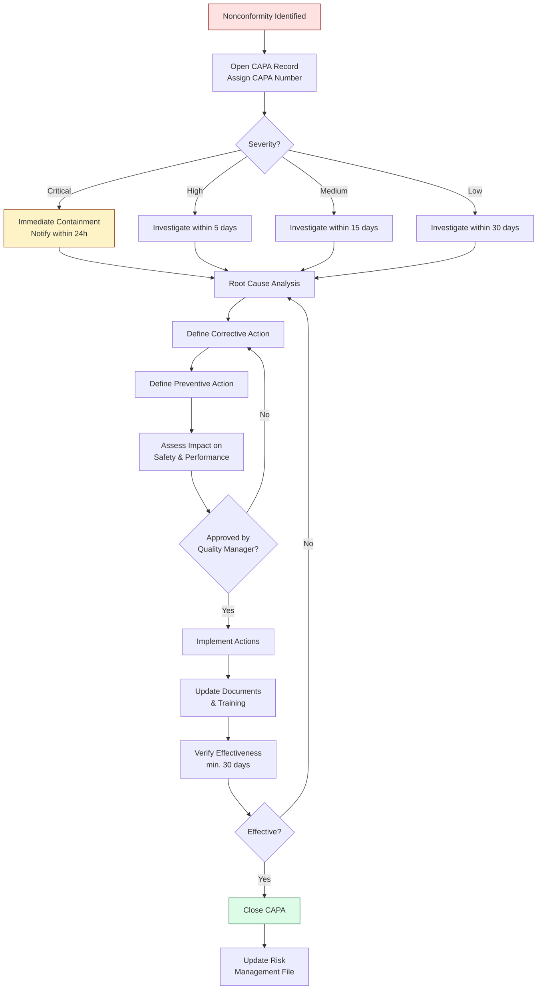

# CAPA Process Flow

This diagram illustrates the corrective and preventive action process as defined in [[SOP-003]].

## Process Steps

### 1. Identification
Nonconformity identified from any source: complaint, audit, deviation, post-market surveillance, or management review.

### 2. Classification
Severity classified as Critical, High, Medium, or Low based on patient safety impact and regulatory implications.

### 3. Root Cause Analysis
Investigation using appropriate methods (5 Why, Fishbone, Fault Tree Analysis).

### 4. Action Planning
Corrective actions address the immediate issue. Preventive actions prevent recurrence. Impact on safety and performance assessed before approval.

### 5. Implementation
Actions implemented per timeline. Documents updated, training provided.

### 6. Effectiveness Verification
Data collected over minimum 30 days. If not effective, return to root cause analysis.

### 7. Closure
Quality Manager reviews and closes. Risk management file updated.

## Related Documents
- [[SOP-003]] CAPA Procedure
- [[FM-001]] CAPA Form
- [[RA-001]] Risk Management File
