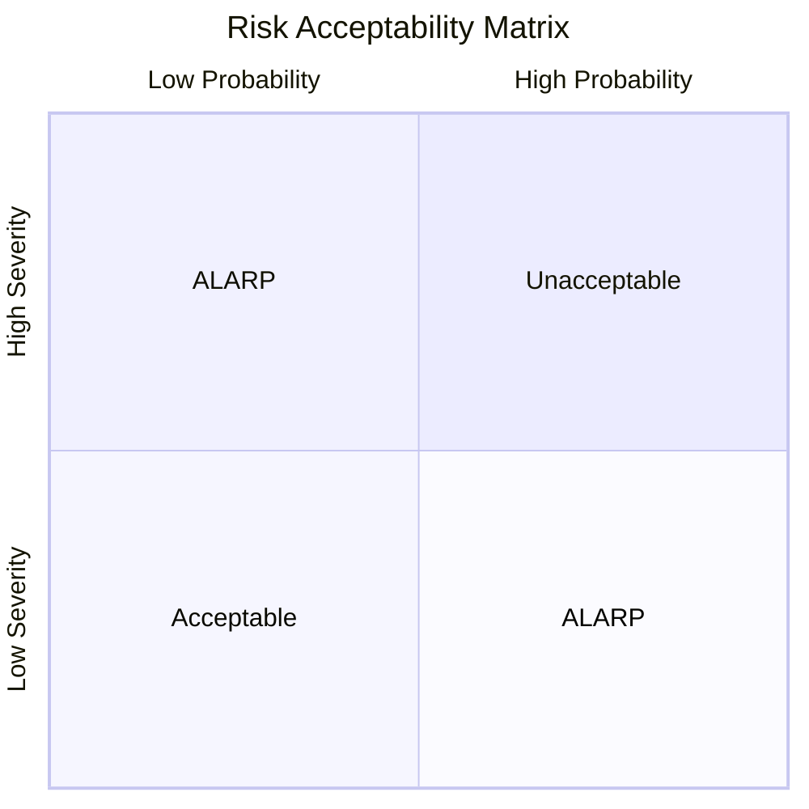

# Risk Management Plan

## 1. Purpose

This plan defines the risk management process for the Therapeak AI therapy platform, in accordance with ISO 14971:2019 and EU MDR 2017/745 Annex I.

## 2. Scope

This plan covers all stages of the medical device lifecycle:
- Design and development
- Production (deployment)
- Post-production (monitoring, updates)

## 3. Risk Management Activities

| Activity | Responsibility | Timing | Output |
|----------|---------------|--------|--------|
| Hazard identification | Development Lead | Design phase | Hazard list |
| Risk estimation | Development Lead + Quality | Design phase | Risk matrix |
| Risk evaluation | Quality Manager | Before release | Risk evaluation report |
| Risk control | Development Lead | Before release | Control measures |
| Residual risk evaluation | Quality Manager | Before release | Benefit-risk analysis |
| Post-market monitoring | Quality Manager | Ongoing | PMS reports |

## 4. Risk Acceptability Criteria

| Severity \ Probability | Rare | Unlikely | Possible | Likely | Frequent |
|----------------------|------|----------|----------|--------|----------|
| **Catastrophic** | ALARP | Unacceptable | Unacceptable | Unacceptable | Unacceptable |
| **Critical** | ALARP | ALARP | Unacceptable | Unacceptable | Unacceptable |
| **Serious** | Acceptable | ALARP | ALARP | Unacceptable | Unacceptable |
| **Minor** | Acceptable | Acceptable | ALARP | ALARP | Unacceptable |
| **Negligible** | Acceptable | Acceptable | Acceptable | Acceptable | ALARP |

## 5. Risk Control Priorities

Per EU MDR Annex I Section 4, risk control measures shall be applied in this order:
1. Eliminate or reduce risks through safe design
2. Adequate protection measures (including alarms)
3. Information for safety (warnings, training)

## 6. References

- [[RA-001]] Risk Management File
- [[SOP-002]] Risk Management Procedure
- ISO 14971:2019
- EU MDR 2017/745 Annex I, Sections 3-4
