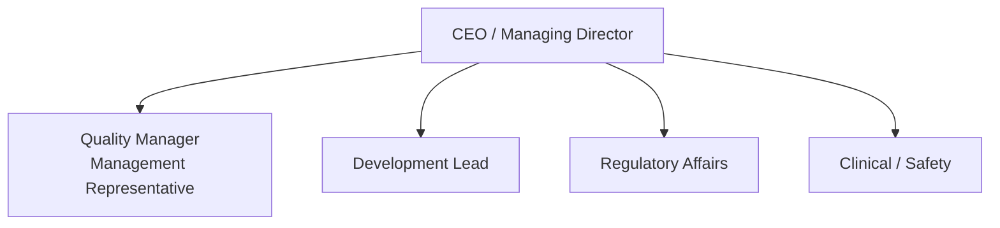
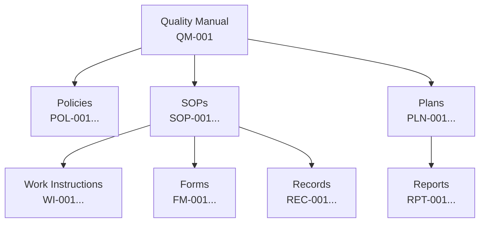

# Quality Manual

## 1. Purpose

This Quality Manual describes the Quality Management System (QMS) of Therapeak B.V. in accordance with ISO 13485:2016 and EU MDR 2017/745. It serves as the top-level document of the QMS and provides a framework for the design, development, and maintenance of our medical device software.

## 2. Scope

### 2.1 QMS Scope
This QMS applies to the design, development, maintenance, and post-market surveillance of AI-based therapy software classified as a Class IIa medical device under EU MDR 2017/745.

### 2.2 Exclusions
The following ISO 13485:2016 requirements are not applicable:
- Clause 7.5.5 (Sterile medical devices) — Software is not a sterile product
- Clause 7.5.7 (Sterilization validation) — Not applicable
- Clause 6.4.2 (Contamination control) — Not applicable to software

Justification: These clauses relate to physical manufacturing processes that do not apply to software-only medical devices.

### 2.3 Regulatory Framework
- ISO 13485:2016 — Quality management systems for medical devices
- EU MDR 2017/745 — European Medical Device Regulation
- ISO 14971:2019 — Application of risk management to medical devices

## 3. Company Information

### 3.1 Organization
- **Company:** Therapeak B.V.
- **Role under MDR:** Manufacturer
- **Classification:** Class IIa (Rule 11)
- **Conformity assessment route:** Annex IX

### 3.2 Organization Chart

## 4. Quality Policy

Therapeak B.V. is committed to:

1. Ensuring the safety and performance of our medical device software
2. Meeting all applicable regulatory requirements including EU MDR 2017/745
3. Continuously improving the effectiveness of our Quality Management System
4. Maintaining compliance with ISO 13485:2016
5. Providing safe, effective therapy through our AI-based platform

This policy is communicated to all personnel and reviewed annually during management review.

## 5. Quality Objectives

| Objective | Measure | Target |
|-----------|---------|--------|
| Customer satisfaction | Complaint rate | < 1% of active users |
| Product safety | Serious incidents reported | 0 |
| Regulatory compliance | Audit findings | 0 major nonconformities |
| CAPA effectiveness | CAPAs closed within target | > 90% |
| Document control | Documents reviewed on schedule | 100% |

## 6. QMS Documentation Structure

### 6.1 Document Hierarchy
1. **Quality Manual** (this document) — Top-level QMS description
2. **Policies** — High-level statements of intent
3. **Standard Operating Procedures** — Detailed process descriptions
4. **Work Instructions** — Step-by-step task instructions
5. **Forms and Records** — Evidence of QMS execution
6. **Plans and Reports** — Project-specific documentation

## 7. Process Interactions

The QMS processes interact as follows:

| Process | ISO 13485 Clause | Key SOPs |
|---------|-----------------|----------|
| Document Control | 4.2.4, 4.2.5 | [[SOP-001]] |
| Risk Management | 7.1 | [[SOP-002]], [[PLN-001]] |
| CAPA | 8.5.2, 8.5.3 | [[SOP-003]] |
| Complaint Handling | 8.2.2 | [[SOP-004]] |
| Internal Audit | 8.2.4 | [[SOP-005]] |
| Management Review | 5.6 | [[SOP-006]] |
| Design and Development | 7.3 | [[SOP-007]] |
| Purchasing | 7.4 | [[SOP-008]] |
| Post-Market Surveillance | 8.2.1 | [[SOP-009]] |
| Training | 6.2 | [[SOP-010]] |

## 8. Management Responsibility

### 8.1 Management Commitment
Top management demonstrates commitment by:
- Establishing and maintaining the quality policy
- Ensuring quality objectives are established
- Conducting management reviews
- Ensuring availability of resources

### 8.2 Management Representative
The Quality Manager serves as Management Representative with authority to:
- Ensure QMS processes are documented and maintained
- Report on QMS effectiveness to top management
- Ensure promotion of regulatory awareness

## 9. References

- ISO 13485:2016 — Quality management systems for medical devices
- EU MDR 2017/745 — European Medical Device Regulation
- ISO 14971:2019 — Application of risk management to medical devices
- [[SOP-001]] Document Control Procedure
- [[POL-001]] Quality Policy
